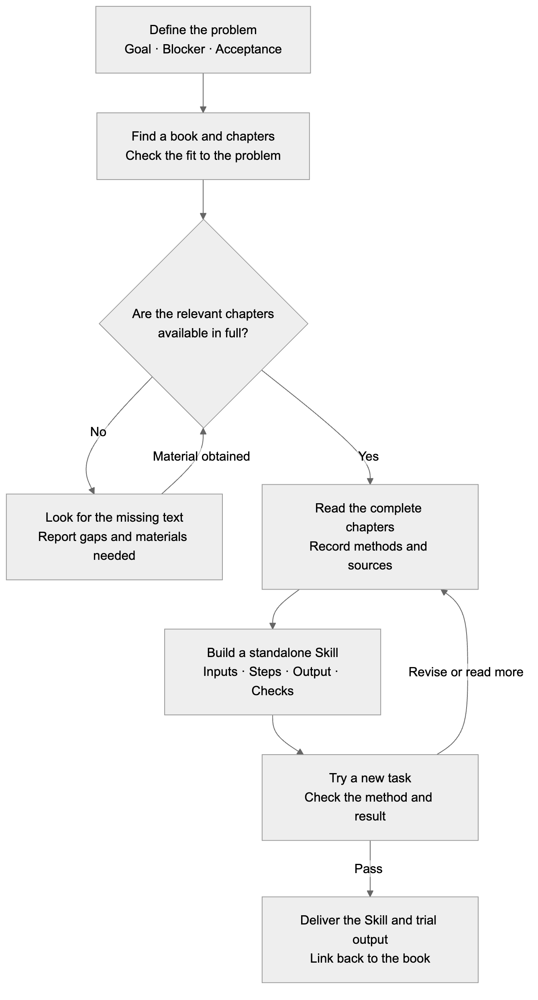

[简体中文](README.md) · **English** · [日本語](README.ja.md)

# QBS · Build a Skill in an unfamiliar field, starting with a question

> *“Bring your question. Let AI find books, read the relevant chapters, and turn their methods into a Skill of your own.”*

[](skills/qbs/SKILL.md)
[](https://github.com/LearnPrompt/qbs/actions/workflows/check.yml)
[](LICENSE)

**QBS = Question → Book → Skill.** You bring a problem you want to solve. QBS guides AI to find relevant books, read the relevant main-text chapters in full, extract methods, build a Skill you can invoke independently, and test it on an actual task.

[How to build a Skill](#workflow) · [Install QBS](#install) · [First use](#first-use) · [What you get](#deliverables) · [Examples and progress](#examples)

---

<a id="why-qbs"></a>

## You want to make a Skill. What experience should go into it?

When you use Codex every day and keep running into the same problem, saving a way to handle it as a Skill feels natural.

But what happens when the field is unfamiliar? You haven't read the books or built up much experience. Which steps should you include? How can you check the judgments AI makes?

Turning a few conversations into a file gives you a file. It still leaves the basis for the method unresolved.

That's why we made QBS. Describe the problem in front of you, then let AI find books, obtain the main text, read it, and extract methods. Read the chapters relevant to this one problem, then turn the author's methods, conditions, and exceptions into steps you can follow and check.

**Start with a real problem and make a Skill with sources, something you can try and keep improving. You don't need to study the entire field first.**

<a id="workflow"></a>

## From a question to your own Skill



[Diagram source](assets/qbs-flow.en.mmd)

The full process is in the [QBS Skill](skills/qbs/SKILL.md). If the main text isn't available, it reports the specific gaps. Finding a title or reading a foreword does not count as reading the relevant chapters.

### How fast can it be?

You can start directly with your problem, without first choosing books yourself or studying the entire field. QBS connects finding books, reading, building, and trying the Skill in one workflow. The time needed depends on access to the main text, how much needs reading, and how many revisions the trial calls for. We don't yet have complete timing data, so we aren't promising “done in minutes.”

<a id="install"></a>

## Install QBS with one command

On a computer with Node.js, npm (including `npx`), and Git installed, run:

```bash
npx skills@latest add LearnPrompt/qbs --skill qbs
```

Select the Agent you use. Installation defaults to the current project; add `-g` to the end of the command to use it across all projects. After installation, open a new session and ask QBS to help you make your own Skill.

<details>
<summary>Choose an Agent</summary>

Install for Codex and Claude Code in the current project:

```bash
npx skills@latest add LearnPrompt/qbs --skill qbs -a codex claude-code -y
```

</details>

[Installer and options](https://github.com/vercel-labs/skills#install-a-skill) · [Installation checks](docs/npx-install-check.md) · [Manual installation](docs/manual-install.md). If you already have a Skill with the same name and have edited it, back it up before updating.

<a id="first-use"></a>

## After installation, give QBS your problem

Replace the brackets below with your own situation, then send this to your Agent:

```text
Use $qbs. I'm unfamiliar with [field], and I want to solve [specific problem]. The result I want is [something I can check]. Find relevant books, obtain and read the relevant main-text chapters in full, turn the methods into a Skill I can invoke independently, and try it on a new task. Deliver the Skill, the trial results, and a record of the chapters actually read and the sources for the methods. If the full main text isn't available, explain the specific gaps.
```

For example: “Use $qbs. When I build small features in Codex, the requirements keep growing with every conversation. Find books and read the relevant chapters in full, make a Skill that helps me define this round's scope, then try it on my current feature request.”

You don't need to know a book title in advance. If you've already chosen a book or have an electronic file or chapter materials, you can provide them too.

<a id="deliverables"></a>

## What should you get at the end?

| Deliverable | What you can check |
|---|---|
| A Skill you can invoke independently | When to use it, what input it needs, which steps to follow, and what it delivers |
| Sources and a reading record | Which chapters of which books were actually read, which rules came from the books, and which were added for the scenario |
| Output from a trial on a new task | What the input was, how the method was used, and which acceptance checks passed or failed |
| A place to keep reading | Where the method used appears in the book and where to start if you want to explore further |

When a similar problem comes up, invoke the Skill you've made. For a new field, start with QBS again. A book list or an untested file alone doesn't complete the process.

---

<a id="examples"></a>
<a id="everyday-problems"></a>
<a id="reading-status"></a>

## What we're making through this process

We started with two recurring Codex problems, read the relevant chapters in full, and built two independently installable Skills. The scheduling example remains an early draft. QBS is the method used to make these Skills; for a new field, start with QBS again.

<table>
<tr>
<td align="center" width="33%"><a href="books/shape-up.md"></a><br><a href="books/shape-up.md"><strong>Shape Up</strong></a><br>Keep a small feature in scope<br><sub>Official print cover</sub></td>
<td align="center" width="33%"><a href="books/the-debugging-book.md"></a><br><a href="books/the-debugging-book.md"><strong>The Debugging Book</strong></a><br>Stop guessing while debugging<br><sub>Official website preview · online textbook</sub></td>
<td align="center" width="33%"><a href="books/high-output-management.md"></a><br><a href="books/high-output-management.md"><strong>High Output Management</strong></a><br>Delegate, schedule, and verify<br><sub>Official cover · early draft</sub></td>
</tr>
</table>

| Skill | Reading and validation |
|---|---|
| `shape-up` | Chapters 3 and 14 read in full; new-task trials cover scope, quality issues near a deadline, and unclear requirements |
| `the-debugging-book` | Introduction to Debugging read in full, including solutions; trials include an actual code repair and an evidence-limited scenario |
| `high-output-management` | Installable draft; only the public newer-edition foreword read in full. Relevant main-text chapters are still missing, so it does not meet the current QBS reading requirement |

[Trial inputs, raw outputs, and item-by-item review](evals/book-skills-2026-09-18/REPORT.md). These are simulated tasks, not evidence of real-team effectiveness or superiority over ordinary conversation.

### Try a finished Skill directly

To install just one, keep only its name.

```bash
npx skills@latest add LearnPrompt/qbs --skill shape-up the-debugging-book
```

```text
Use $shape-up. I want to export the current filtered customer list, with an appetite of two half-days. Define necessary scope, deferred items, unknowns, and acceptance checks.

Use $the-debugging-book. Pagination works on the first call, but changing pages repeats old results. Reproduce it, distinguish causes through experiments, fix it, and run regression checks. Point me to the chapter behind the key judgment.
```

<a id="scheduling-flow"></a>

<details>
<summary>Expand the first output example: a scheduling Skill draft</summary>

Two videos each need 3 hours of editing, but the only editor has just 5 hours available. The draft's simulated output identified that the work wouldn't fit and required checking review, revision, and publication time again. The two scheduling and acceptance flowcharts are in the [case details](docs/scheduling-example.en.md); they describe this child Skill's business workflow.

[Simulation inputs and actual outputs](evals/RESULTS.md) · [Draft entry point](skills/high-output-management/SKILL.md)

If you happen to want to try this draft, install it separately:

```bash
npx skills@latest add LearnPrompt/qbs --skill high-output-management
```

```text
Use $high-output-management. Both video drafts arrive at 13:00, and each needs 3 hours of editing. The only editor is available from 13:00 to 18:00, and both videos are intended for publication at 18:00. First determine whether the work fits, then tell me what decisions I need to make. Don't assume anyone will work overtime.
```

These are scenario designs and simulations. In the earlier [three-way comparison](evals/comparison-2026-09-18/REPORT.md), ordinary conversation also reached the correct core conclusions. It did not establish that this draft performs better than direct conversation.

</details>

<details>
<summary>Validation commands for maintainers</summary>

```bash
python3 scripts/validate.py
python3 -m unittest discover -s tests -v
```

These check Skill packages, references, the book index, multilingual documentation links, installed-file readback, and failure handling. [GitHub Actions](https://github.com/LearnPrompt/qbs/actions/workflows/check.yml) runs the checks automatically, and the badge at the top shows their actual status. Whether the methods from the books help in practice still depends on trial records from the corresponding tasks.

</details>

<a id="next-book"></a>

## Try a method, and perhaps you'll want to open the book

It's been a while since we really read a book. So I also want this process to leave one small next step: whenever a Skill delivers its result, tell me which chapter that decision came from.

Let a method take part in today's work first. If it helps, curiosity may follow: why does the author think this way, and what else is worth reading?

**Make a Skill with a question in mind. Then return to the book with the curiosity that using it creates.**

[Child Skill contract](skills/qbs/references/child-contract.md) · [MIT](LICENSE) (applies to this project's original code and documentation; book texts and covers remain the copyright of their respective rights holders)
