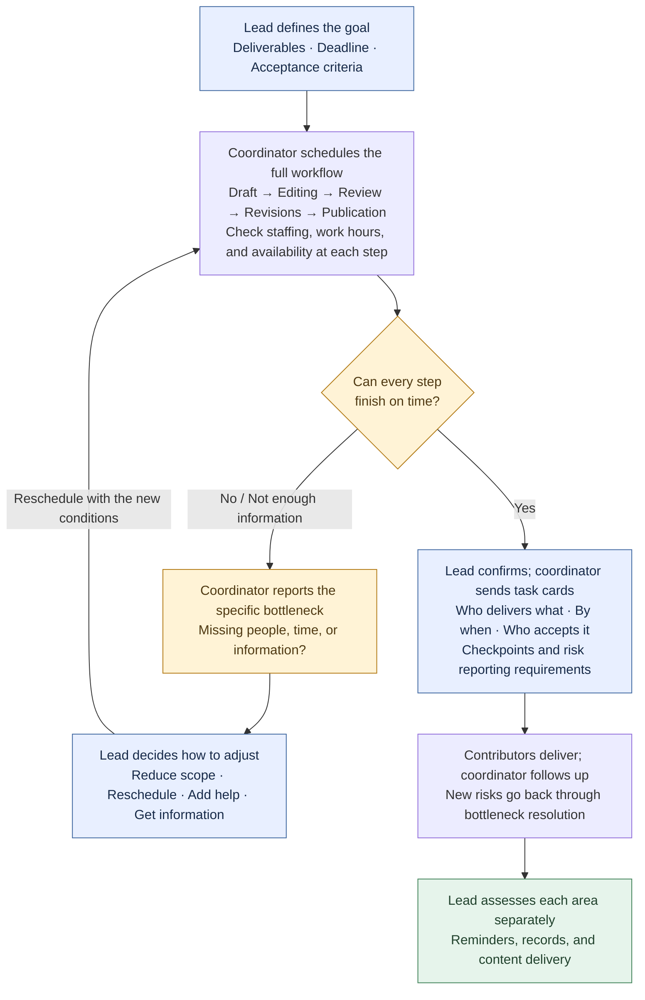
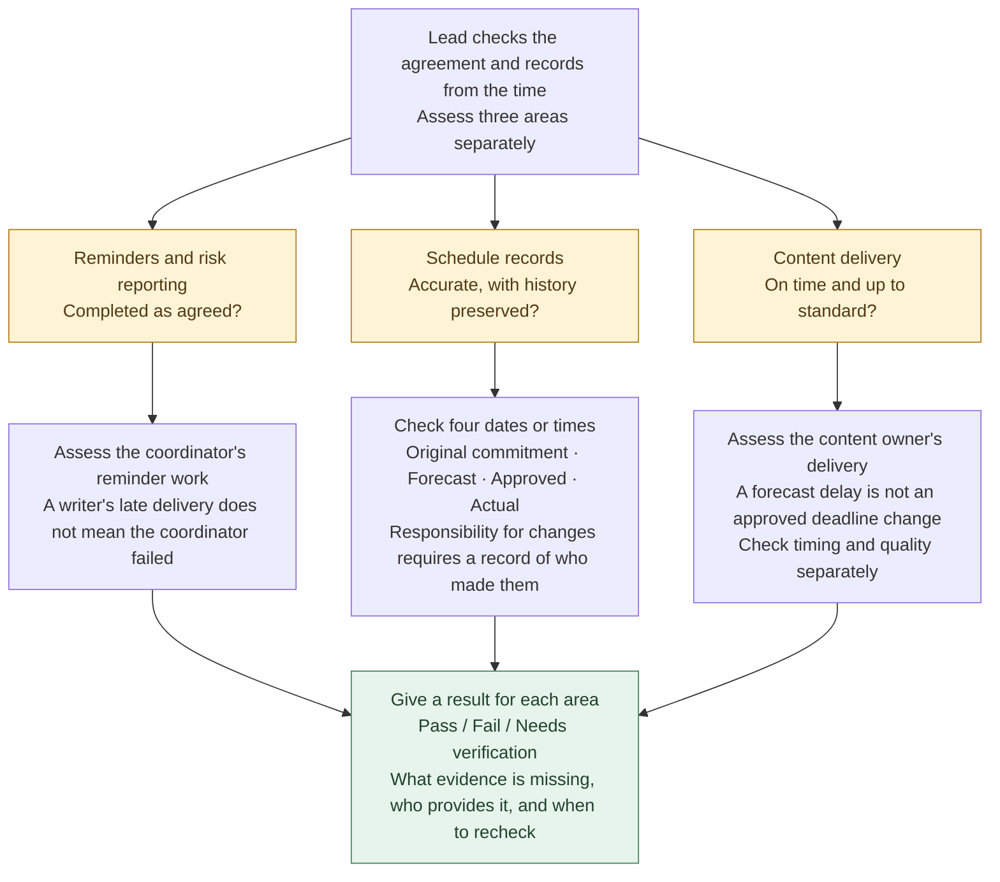

[简体中文](README.md) · **English** · [日本語](README.ja.md)

# QBS · Everyday Skills that lead us back to books

> *“Let a book help with today's work. Then see if you want to read it.”*

[](skills/qbs/SKILL.md)
[](https://github.com/LearnPrompt/qbs/actions/workflows/check.yml)
[](LICENSE)

[Why QBS](#why-qbs) · [Three everyday problems](#everyday-problems) · [Scheduling flow](#scheduling-flow) · [Install](#install) · [Reading status](#reading-status) · [Your next book](#next-book)

Book pages and reports are currently in Chinese.

---

<a id="why-qbs"></a>

## It's been a while since we really read a book

Every day, we open Codex to write, edit code, and build things. We've installed plenty of Skills. When a problem comes up, looking for one that might help feels natural.

But it's been a while since we sat down with a book.

So I wanted to try making the things we already do every day a way back into reading.

Maybe you want to hand scheduling over to a colleague, but aren't sure what a clear handoff looks like. Maybe you set out to change one small feature, only to watch the task list grow with every conversation. Or maybe you've tried fixing a bug several times and still can't explain what caused it.

Start with one of those problems. Ask AI to find a relevant book, read the relevant chapters in full, turn a useful method into a Skill, and bring it back to our work to try.

If it actually helps, curiosity might return.

Why did it ask that question first? Why did building fewer features bring me closer to the result I wanted? What else does this method offer that I haven't tried?

By then, you have questions of your own to take into the author's chapter.

**That's what I want QBS to do: let a book connect with our lives in some small way. Try one of its methods, then feel like reading a little more.**

`Today's problem → Find a book → AI reads the relevant chapters in full → Make a Skill → Use it on today's task → Return to the book with questions`

Whenever we use a method from a book, we leave a specific place to start reading alongside the deliverable. Follow it to see where that decision came from and why the author thinks that way.

---

<a id="everyday-problems"></a>

## Start with three everyday problems

### I delegated the work. Why am I still chasing it?

The first book is Andrew S. Grove's *High Output Management*. The problem is specific: handing a content team's schedule over to an operations coordinator. We need to spell out what to hand over, who decides when plans conflict, and how completed work will be assessed.

The first version draws on a full reading of only the publicly available foreword. Its rules mainly come from designing for this scenario, so it remains a draft.

We tried the draft in a scheduling simulation. Two videos each need 3 hours of editing, but the only editor has just 5 hours available that day. No matter how tidy the schedule looks, 6 hours of work won't fit. Someone needs to decide whether to reduce the work, move the deadline, or add help, then make sure review and revisions fit too.

This example opens up further questions: where is the team's output really getting stuck? What can the person in charge do to save everyone some unnecessary work?

[See the scheduling flow](#scheduling-flow) · [The book and the current draft](books/high-output-management.md)

### I only wanted a small feature. Why does it keep growing?

When building a project in Codex, it's easy for a conversation about a specific need to turn into plans for an entire system. The feature list gets longer, while what we're actually delivering this round gets less clear.

The second book is Ryan Singer's *Shape Up*. Chapter 3 starts by asking how much time this problem is worth, then uses that boundary to determine the size of the solution. The book gives a concrete example: users ask for complex permission controls, but after digging into the real concern, a reminder before archiving may be enough to solve it.

In our own work, that could mean narrowing “improve the installation experience” to “let a first-time visitor install with one command and know what to say next.” Finish that, and we have something usable.

The question I want to keep reading about is: how do we remove some of the work while keeping what actually matters?

[Read Chapter 3: Set Boundaries](https://basecamp.com/shapeup/1.2-chapter-03) · [Why this book and what we've read](books/shape-up.md)

### I've tried several bug fixes. Why am I still guessing?

Here's another familiar situation: an error appears, so we try changing a parameter, then rewriting something. Sometimes it works, but we can't say which change made the difference. When it happens again, we have to start over.

The third book is Andreas Zeller's *The Debugging Book*. Its online chapters can be read and run directly, making it a useful place to examine the debugging process step by step.

We plan to start with “reproduce the failure, then propose a hypothesis that could be disproved.” Before changing code, Codex should explain what the check is meant to test. After seeing the result, it should identify which hypotheses still hold. Finally, it should check the fix against the original failing case.

That gives the next reading session a concrete question: what evidence is enough to convince me that I've found the cause?

[Read Introduction to Debugging](https://www.debuggingbook.org/html/Intro_Debugging.html) · [Why this book and what we've read](books/the-debugging-book.md)

---

<a id="scheduling-flow"></a>

## A scheduling flow for the person in charge

**The lead defines deliverables and approves changes; the coordinator schedules milestones and reports conflicts; contributors deliver the work.**

### First, schedule the work: if it won't fit, bring options to the lead



For example: both video drafts arrive at 13:00, each needs 3 hours of editing, and both are intended for publication at 18:00. The only editor is available from 13:00 to 18:00. **There are 6 hours of work and only 5 hours available**, so the editing stage already makes the schedule impossible. **19:00 is outside the editor's working hours and cannot be treated as available time. Even with another editor, review, revisions, and publication must all be checked again.**

### Then, assess the work: sending reminders doesn't mean everything passed



For example: the coordinator sent reminders and reported risks as agreed, but the writer still delivered late. The reminder work can pass while on-time content delivery still fails. If the spreadsheet lost the original deadline, record keeping needs a separate check. **Do not erase a delay by changing the deadline, or introduce new criteria after the fact to penalize past actions.**

[See the inputs and actual outputs from this simulation](evals/RESULTS.md).

---

<a id="install"></a>

## Install

On a computer with Node.js, npm (including `npx`), and Git installed, run:

```bash
npx skills@latest add LearnPrompt/qbs
```

In the interactive installer, select `qbs`, `high-output-management`, and the Agent you use. When run inside an Agent, the installer may select the current Agent automatically. Installation defaults to the current project; add `-g` to the end of the command to use the Skills across all projects. You don't need to clone the repository manually or install Python. [Installer and options](https://github.com/vercel-labs/skills#install-a-skill).

**After installation, copy this first message to your Agent:**

```text
Use $qbs. I want to hand my content team's scheduling over to an operations coordinator, but I'm not sure how to handle the handoff or assess the results. Find a relevant book, obtain and read the relevant chapters of the main text in full, turn methods with source references into a Skill, then give me an actual task card, schedule, and assessment results. If you can't obtain the main text, say which chapters are missing. Don't generate the Skill from the foreword alone.
```

To try just the existing scheduling draft, say:

```text
Use $high-output-management. Both video drafts arrive at 13:00, and each needs 3 hours of editing. The only editor is available from 13:00 to 18:00, and both videos are intended for publication at 18:00. First determine whether the work fits, then tell me what decisions I need to make. Don't assume anyone will work overtime.
```

<details>
<summary>Choose an Agent or install just one Skill</summary>

Install both Skills for Codex and Claude Code in the current project:

```bash
npx skills@latest add LearnPrompt/qbs --skill qbs high-output-management -a codex claude-code -y
```

Install only the workflow for finding books, reading them, and making Skills:

```bash
npx skills@latest add LearnPrompt/qbs --skill qbs
```

Install only the current content team draft:

```bash
npx skills@latest add LearnPrompt/qbs --skill high-output-management
```

</details>

After installation, open a new session and invoke the corresponding Skill. We have tested installing both Skills together and each one separately from GitHub, and checked the Skill text, templates, and reference materials file by file. [See the installation checks](docs/npx-install-check.md). If you already have a Skill with the same name and have edited it, back it up before updating.

For manual copying or repository maintenance, see [manual installation](docs/manual-install.md).

---

<a id="reading-status"></a>

## Where we are with these books

| Book | The problem we're working on | Progress |
|---|---|---|
| [High Output Management](books/high-output-management.md) | Delegation, scheduling, and assessment | An installable draft exists; only the publicly available foreword to the newer edition has been read in full so far. Relevant main-text chapters still need to be read. |
| [Shape Up](books/shape-up.md) | How to set this round's scope when requirements keep growing | Chapters 3 and 14 read in full; not yet packaged as a child Skill. |
| [The Debugging Book](books/the-debugging-book.md) | How to debug with evidence instead of repeatedly trying changes | Introduction to Debugging read in full, including exercise solutions; not yet packaged as a child Skill. |

The package currently has two entry points: `qbs` and `high-output-management`. For the two newly added books, we are first reading the chapters carefully, then working toward extracting and trying methods in real tasks. The book pages keep references to the methods and places to continue reading.

The scheduling case is a simulation, not evidence of a team's performance. In the earlier [three-way comparison](evals/comparison-2026-09-18/REPORT.md), ordinary conversation also reached the correct core conclusions. We'll keep recording what the Skills actually help with in everyday tasks, and whether they make people want to return to the books.

<details>
<summary>Validation commands for maintainers</summary>

Maintainers run these checks when modifying or releasing the repository. They are not required for ordinary installation:

```bash
python3 scripts/validate.py
python3 -m unittest discover -s tests -v
```

The first command checks Skill packages, references, the book index, covers, and links in the multilingual documentation. The second tests reading installed files back, installing Skills separately, refusing to overwrite files, and handling failures. [GitHub Actions](https://github.com/LearnPrompt/qbs/actions/workflows/check.yml) runs them automatically on every push and pull request, and the badge at the top shows their actual status. Passing means these checks passed; it does not establish that the methods from the books are effective in practice.

</details>

<a id="next-book"></a>

## Find the next book through a problem of your own

Once you've installed QBS, give it one thing you're stuck on today. It will look for a book, check access to the main text, read the relevant chapters, and turn the method into steps you can use. You can start with this message:

```text
Use $qbs. A problem I keep running into lately is… Find a book that can help me understand it, read the relevant chapters in full, turn the method into a Skill, and try it on today's task. When you deliver the result, tell me where the method we used appears in the book. I'd like to keep reading on my own.
```

If you already have a book or an electronic file, you can provide it directly. For source records and trial requirements for new methods, see the [child Skill contract](skills/qbs/references/child-contract.md).

**Solve one small problem first. Then, perhaps, we'll want to open the book.**

The [MIT license](LICENSE) applies to this project's original code and documentation. Book texts and covers remain the copyright of their respective rights holders.
