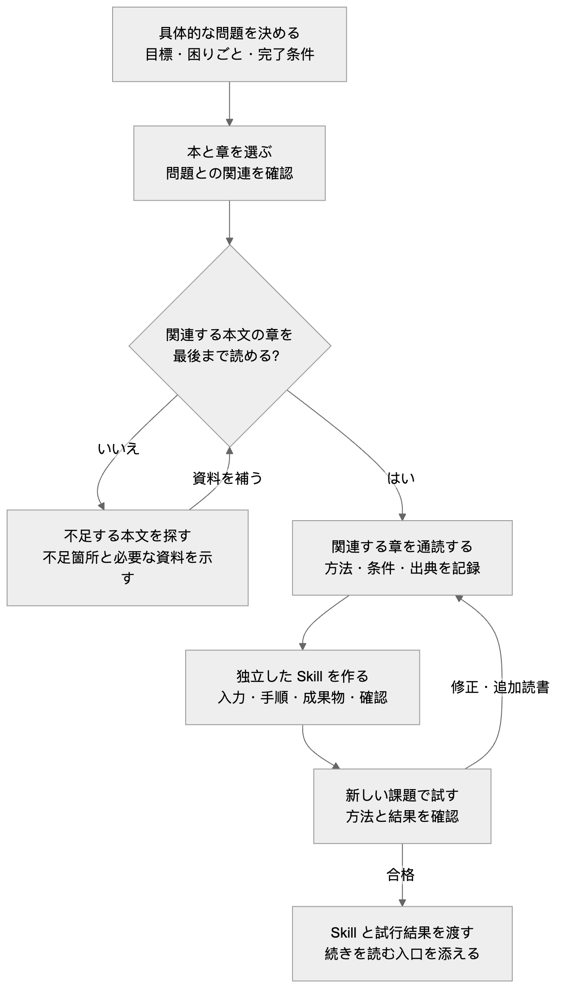

[简体中文](README.md) · [English](README.en.md) · **日本語**

# QBS · 知らない分野でも、自分の問いから Skill を作る

> *「自分の困りごとを渡す。AI が本を探し、関連する章を読み、方法を自分の Skill にする。」*

[](skills/qbs/SKILL.md)
[](https://github.com/LearnPrompt/qbs/actions/workflows/check.yml)
[](LICENSE)

**QBS = Question → Book → Skill。** 解決したい問題を1つ渡すと、QBS が AI に関連する本を探させ、該当する本文の章を最後まで読ませ、方法を取り出します。それを単独で呼び出せる Skill にして、実際のタスクで確かめます。

[Skill を作る流れ](#workflow) · [QBS をインストール](#install) · [初めて使う](#first-use) · [受け取るもの](#deliverables) · [制作事例と進捗](#examples)

---

<a id="why-qbs"></a>

## Skill を作りたい。でも、どんな経験を書けばいいかわからない

毎日 Codex を使い、同じ問題に何度も出会うと、その対処法を Skill に残したくなります。

ところが、自分が詳しくない分野では迷います。関連する本を読んだことも、十分な経験もない。どんな手順を書けばよいのでしょう。AI の判断が正しいか、どう確かめればよいのでしょう。

数回の対話をファイルにまとめれば、ファイルはできます。でも、その方法の根拠はまだわかりません。

そこで QBS を作りました。まず、目の前の問題を具体的に伝えてください。本を探し、本文を入手し、読んで方法を取り出す作業は AI に任せます。その問題に関係する章を読み、著者の方法、適用条件、例外を、実行して確認できる手順に変えます。

**実際の問題から始めて、出典があり、試して改善できる Skill を作る。その分野を一通り学び終えるまで、待つ必要はありません。**

<a id="workflow"></a>

## 自分の問いから、自分の Skill へ



[図のソース](assets/qbs-flow.ja.mmd)

詳しい手順は [QBS Skill](skills/qbs/SKILL.md) にあります。本文を入手できなければ、何が不足しているかを報告します。本の名前を見つけたり、序文を読んだりしただけでは、関連する章を読了したことにはなりません。

### どれくらい早く作れる？

自分で本を選び、その分野を一通り勉強してから始める必要はありません。自分の問いを、そのまま出発点にできます。QBS は選書、読書、制作、試行を一つの流れにつなぎます。実際にかかる時間は、本文を入手できるか、読む量、試行後の修正回数によって変わります。現時点では工程全体の計測データがないため、「数分で完成」とは約束していません。

<a id="install"></a>

## 1行で QBS をインストール

Node.js、npm（`npx` を含む）、Git がインストール済みなら、次のコマンドを実行します。

```bash
npx skills@latest add LearnPrompt/qbs --skill qbs
```

使用する Agent を選びます。既定では現在のプロジェクトにインストールされます。すべてのプロジェクトで使う場合は、コマンドの末尾に `-g` を付けてください。インストール後、新しいセッションを開けば、QBS に自分の Skill を作ってもらえます。

<details>
<summary>Agent を指定する</summary>

現在のプロジェクトの Codex と Claude Code にインストールします。

```bash
npx skills@latest add LearnPrompt/qbs --skill qbs -a codex claude-code -y
```

</details>

[インストーラーとオプションの説明](https://github.com/vercel-labs/skills#install-a-skill) · [インストールの検証記録](docs/npx-install-check.md) · [手動インストール](docs/manual-install.md)。同名の Skill がすでにあり、内容を変更している場合は、更新前にバックアップしてください。

<a id="first-use"></a>

## インストールしたら、自分の問題を QBS に渡す

次の角括弧を自分の状況に置き換え、そのまま Agent に伝えてください。

```text
$qbs を使ってください。[分野]には詳しくありませんが、今は[具体的な問題]を解決し、最後に[確認できる結果]を得たいです。関連する本を自分で探し、該当する本文の章を入手して最後まで読み、方法を単独で呼び出せる Skill にしてください。その後、新しいタスクで一度試してください。Skill、試行結果、実際に読んだ章、方法の出典を渡してください。本文を完全な形で入手できない場合は、何が不足しているか具体的に説明してください。
```

たとえば、「$qbs を使ってください。Codex で小さな機能を作るとき、話すうちに要件が膨らみがちです。本を探して関連する章を最後まで読み、今回の範囲を決めるための Skill を作ってください。その後、今回の機能要望で試してください」と伝えられます。

あらかじめ書名を知っている必要はありません。すでに本を選んでいたり、電子ファイルや章の資料を持っていたりする場合は、一緒に渡せます。

<a id="deliverables"></a>

## 完了時に、何を受け取れるか

| 受け取るもの | 確認できること |
|---|---|
| 単独で呼び出せる Skill | いつ使うか、どんな入力が必要か、どの手順で進め、何を出力するか |
| 出典と読書記録 | どの本のどの章を実際に読んだか、どのルールが本に由来し、どれが場面に合わせた補足か |
| 新しいタスクでの試行成果物 | 入力は何か、方法をどう使ったか、どの確認項目が合格・不合格だったか |
| 続きを読むための入口 | 今回使った方法が本のどこにあり、深く知りたくなったときにどこから読めるか |

次に同じ種類の問題が起きたら、作った Skill を直接呼び出せます。別の分野に取り組むときは、また QBS から始めます。本の一覧だけ、あるいはまだ試していないファイルだけでは、この流れは完了していません。

---

<a id="examples"></a>
<a id="everyday-problems"></a>
<a id="reading-status"></a>

## この流れで、私たちは何を作っているか

Codex でよく出会う2つの問題から始め、関連する章を最後まで読み、単独でインストールできる Skill にしました。スケジュール管理は初期の草案として残しています。QBS はこれらの Skill を作る方法です。新しい分野では、また QBS から始めます。

<table>
<tr>
<td align="center" width="33%"><a href="books/shape-up.md"></a><br><a href="books/shape-up.md"><strong>Shape Up</strong></a><br>小さな機能の範囲を決める<br><sub>公式の紙版表紙</sub></td>
<td align="center" width="33%"><a href="books/the-debugging-book.md"></a><br><a href="books/the-debugging-book.md"><strong>The Debugging Book</strong></a><br>当てずっぽうの修正を止める<br><sub>公式サイトの紹介画像 · オンライン教材</sub></td>
<td align="center" width="33%"><a href="books/high-output-management.md"></a><br><a href="books/high-output-management.md"><strong>High Output Management</strong></a><br>分担・日程・完了確認<br><sub>公式表紙 · 初期草案</sub></td>
</tr>
</table>

| Skill | 読了範囲と検証 |
|---|---|
| `shape-up` | 第3章と第14章を読了。範囲の絞り込み、締切直前の品質問題、曖昧な要望の3場面で試行 |
| `the-debugging-book` | Introduction to Debugging を演習解答まで読了。実コードの修正と、証拠が不足する場面で試行 |
| `high-output-management` | インストール可能な草案。公開された新版序文のみ読了。関連する本文は不足しており、現行 QBS の読書要件は未達 |

[試行の入力・実際の出力・項目別判定](evals/book-skills-2026-09-18/REPORT.md)。シミュレーションであり、実チームでの効果や通常の対話より優れていることは示していません。

### 作成済みの Skill を直接試す

1つだけインストールする場合は、その名前だけ残してください。

```bash
npx skills@latest add LearnPrompt/qbs --skill shape-up the-debugging-book
```

```text
$shape-up を使ってください。顧客一覧に「現在の絞り込み結果をエクスポート」を追加したいです。投入上限は半日を2回分。必須範囲、後回しにする項目、未知の条件、完了確認を決めてください。

$the-debugging-book を使ってください。最初のページ取得は正常ですが、ページを変えても古い結果が返ります。再現し、実験で原因を区別して修正と回帰確認を行い、重要な判断の出典も教えてください。
```

<a id="scheduling-flow"></a>

<details>
<summary>最初の成果物の例を開く：スケジュール管理 Skill の草案</summary>

動画2本の編集にそれぞれ3時間かかるのに、編集担当者は1人で、空き時間は5時間だけ。この草案のシミュレーション出力は、予定が成立しないと判断し、レビュー・修正・公開までの時間を改めて確認するよう求めました。スケジュールと完了確認の2つの図は、[事例の詳細](docs/scheduling-example.ja.md)にあります。これらは、この子 Skill の業務フローです。

[シミュレーションの入力と実際の出力](evals/RESULTS.md) · [草案を開く](skills/high-output-management/SKILL.md)

この草案を試したい場合は、別途インストールできます。

```bash
npx skills@latest add LearnPrompt/qbs --skill high-output-management
```

```text
$high-output-management を使ってください。動画2本とも原稿提出が 13:00、編集は各3時間です。編集担当者は1人で、作業できるのは 13:00–18:00。2本とも 18:00 公開を希望しています。まず予定が成立するかを判断し、次に何を決める必要があるかを教えてください。残業できるとは仮定しないでください。
```

これらは場面を設計して行ったシミュレーションです。以前の[3組の比較](evals/comparison-2026-09-18/REPORT.md)では、通常の対話でも中心となる判断は正しくできていました。この草案が通常の対話より優れていることは示せていません。

</details>

<details>
<summary>メンテナー向けの検証コマンド</summary>

```bash
python3 scripts/validate.py
python3 -m unittest discover -s tests -v
```

Skill パッケージ、参照資料、書籍インデックス、多言語ドキュメントのリンク、インストール後のファイル照合、失敗時の処理を確認します。[GitHub Actions](https://github.com/LearnPrompt/qbs/actions/workflows/check.yml) がこれらを自動実行し、ページ上部のバッジに実際の状態を表示します。本の方法が役立つかどうかは、対応するタスクの試行記録で確かめる必要があります。

</details>

<a id="next-book"></a>

## 方法を1つ使ったら、本を開きたくなるかもしれない

私たちは、長いこと本をじっくり読めていません。だから、この流れに小さな続きも残しておきたいのです。Skill が成果物を渡すたびに、先ほどの判断がどの章に由来するかを教えてもらいます。

まず、今日の仕事で方法を使ってみる。それが助けになれば、著者はなぜそう考えたのか、ほかにどこを読めばよいのか、自然と気になってくるかもしれません。

**問いを持って Skill を作り、使ったあとの好奇心を持って、本に戻る。**

[子 Skill の制作契約](skills/qbs/references/child-contract.md) · [MIT](LICENSE)（本プロジェクト独自のコードと説明に適用。書籍本文と表紙の著作権は、それぞれの権利者に帰属します）
