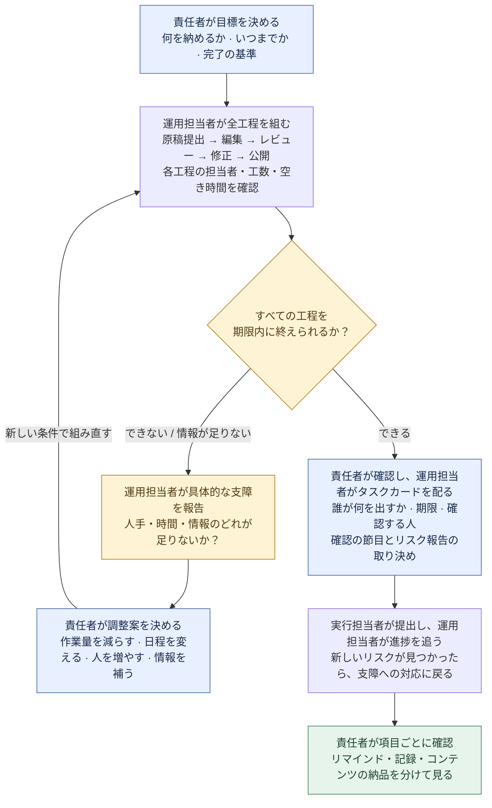
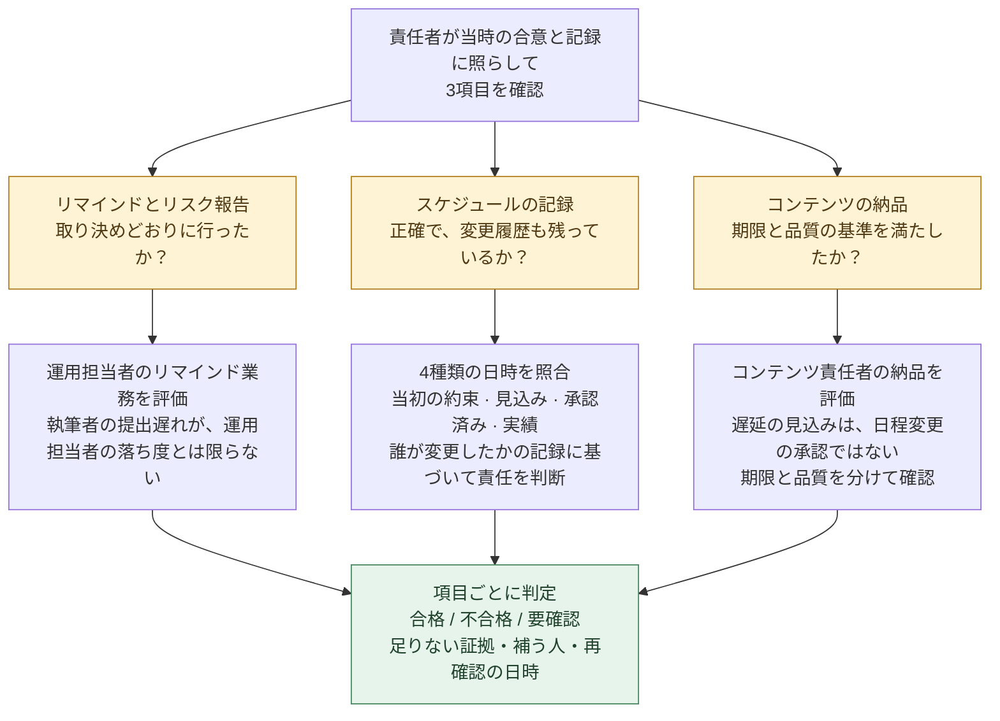

[简体中文](README.md) · [English](README.en.md) · **日本語**

# QBS · いつもの Skill をきっかけに、もう一度本を読みたくなる

> *「まず、今日の困りごとを本に助けてもらう。そこから、続きを読みたくなる。」*

[](skills/qbs/SKILL.md)
[](https://skills.sh/LearnPrompt/qbs)
[](LICENSE)
[](https://github.com/LearnPrompt/qbs/actions/workflows/check.yml)

[作った理由](#why-qbs) · [身近な3つの困りごと](#everyday-problems) · [仕事を割り振る流れ](#scheduling-flow) · [インストール](#install) · [読書の進捗](#reading-status) · [次の1冊へ](#next-book)

書籍紹介ページと検証レポートは、現在中国語で提供しています。

---

<a id="why-qbs"></a>

## しばらく、本をじっくり読んでいない

毎日 Codex を開いて、文章を書いたり、コードを直したり、プロジェクトを進めたりしています。Skill もいろいろ入れました。困ったときには、役に立ちそうなものを探すのが自然になっています。

一方で、本はずいぶん長いこと、じっくり読めていません。

そこで、毎日やっていることの中に、もう一度本を読み始めるきっかけを作れないかと考えました。

たとえば、スケジュール管理を同僚に任せたいけれど、何を伝えれば十分な引き継ぎになるのかわからない。小さな機能を直すだけのつもりが、話しているうちにやることがどんどん増えてしまう。何度も修正したバグなのに、なぜ起きたのかはまだ説明できない。

まず、そのうちの1つについて、AI に関連する本を探してもらう。該当する章を読み終えたら、使える方法を Skill にして、実際の仕事で試してみる。

本当に役に立ったなら、好奇心も戻ってくるかもしれません。

さっき、なぜ最初にあの質問をしたのだろう。機能を減らしたのに、どうして欲しかった結果に近づいたのだろう。この方法には、まだ使っていないどんな考え方があるのだろう。

そうなってから著者の書いた章を読めば、自分なりの問いを持って読み始められます。

**QBS でやりたいのは、まず本と私たちの暮らしに、小さな接点を作ることです。方法を1つ使ってみて、もう少し読みたくなる。そんなきっかけを目指しています。**

`今日の困りごと → 本を探す → AI が関連する章を最後まで読む → Skill にする → 今日の仕事で使う → 好奇心を持って原著に戻る`

本の方法を使うたびに、成果物のそばに、具体的な読み始めの場所を添えます。そこを開けば、先ほどの判断の出典と、著者がそう考える理由をたどれます。

---

<a id="everyday-problems"></a>

## 毎日の仕事で出会う、3つの困りごとから

### 仕事を任せたのに、なぜ自分が見張り続けているのか？

最初の1冊は、Andrew S. Grove の『High Output Management』です。扱う問題は具体的です。コンテンツチームのスケジュール管理を運用担当者に任せるなら、何を引き渡すのか、調整が必要なときに誰が決めるのか、完了をどう確認するのかを、はっきりさせる必要があります。

初版の Skill を作る際に読んだのは、公開されている序文だけです。ルールの多くは想定場面の設計から作ったため、現時点では草案として残しています。

この草案で、スケジュールを組むシミュレーションを1回行いました。動画2本の編集にそれぞれ3時間かかるのに、編集担当者は1人で、その日の空き時間は5時間しかありません。どんなにきれいな表を作っても、6時間分の作業は収まりません。誰かが作業量を減らすか、日程を変えるか、人を増やすかを決め、その後のレビューと修正までつなぐ必要があります。

この例から、さらに問いが生まれます。チームの成果は、どこで詰まっているのか。責任者は何をすれば、みんなの遠回りを減らせるのか。

[仕事を割り振る流れを見る](#scheduling-flow) · [この本と現在の草案](books/high-output-management.md)

### 小さな機能を直すだけのはずが、なぜ話が大きくなるのか？

Codex でプロジェクトを進めていると、具体的な要望を1つ相談しただけなのに、いつの間にかシステム全体の話になることがあります。機能の一覧は長くなる一方で、今回何を届けるのかは、かえって曖昧になっていきます。

2冊目は、Ryan Singer の『Shape Up』を選びました。第3章では、まず「この問題に、どれくらいの時間をかける価値があるか」を問い、その枠に合わせて解決策の規模を決めます。本には具体的な例があります。複雑な権限制御を求めるユーザーに、本当に困っていることを聞いていくと、アーカイブ前の注意表示だけで解決できる場合があるのです。

私たちの仕事なら、「インストール体験を改善する」を、「初めて見た人が、1つのコマンドでインストールでき、その後どう話しかければよいかもわかる」に絞れます。それができれば、使える成果が1つ残ります。

続きを読んで考えたいのは、どうすれば仕事を減らしながら、本当に役立つ部分を残せるのか、ということです。

[第3章 Set Boundaries を読む](https://basecamp.com/shapeup/1.2-chapter-03) · [選書理由と読書記録](books/shape-up.md)

### バグを何度も直しているのに、なぜまだ当てずっぽうなのか？

これもよくある場面です。エラーが出たので、まずパラメーターを変えてみる。次に書き方を変えてみる。たまたま直っても、どの変更が効いたのか説明できず、再発したらやり直しになります。

3冊目は、Andreas Zeller の『The Debugging Book』です。オンラインでそのまま読み、コードを実行できる章が公開されているので、デバッグの過程を一つずつ見ていくのに向いています。

まずは「再現してから、反証できる仮説を立てる」ところから始める予定です。コードを変える前に、今回の確認で何を確かめるのかを Codex に明示してもらう。結果が出たら、どの仮説がまだ成り立つかを整理する。最後に、元の失敗ケースを使って修正を確認します。

すると、次の読書には具体的な問いができます。原因を突き止めたと信じるには、どんな証拠が必要なのだろう。

[Introduction to Debugging を読む](https://www.debuggingbook.org/html/Intro_Debugging.html) · [選書理由と読書記録](books/the-debugging-book.md)

---

<a id="scheduling-flow"></a>

## 責任者は、この流れで仕事を割り振る

**責任者は成果物と変更を決める。運用担当者は工程を組み、支障を報告する。実行担当者は成果物を提出する。**

### まず予定を組む：収まらなければ、選択肢を添えて責任者に相談する



たとえば、動画2本とも原稿提出が 13:00、編集は各3時間、公開希望は 18:00。編集担当者は1人だけで、作業できるのは 13:00–18:00 です。**6時間分の作業に対し、使えるのは5時間だけ**なので、編集の段階で予定が成立しません。**勤務時間外の 19:00 を、空き時間として扱ってはいけません。編集担当者を増やしても、レビュー・修正・公開までつなげられるか、改めて確認する必要があります。**

### 次に完了を確認する：催促したからといって、すべてが合格とは限らない



たとえば、運用担当者は取り決めどおりにリマインドし、リスクも報告したのに、執筆者の提出が遅れたとします。リマインド業務は合格でも、コンテンツの期限内納品は不合格です。表から元の締め切りが消えていたら、記録の管理も別に確認します。**締め切りを書き換えて遅延をなかったことにしたり、後から基準を追加して過去の行動に罰を与えたりしてはいけません。**

[今回のシミュレーションの入力と実際の出力を見る](evals/RESULTS.md)。

---

<a id="install"></a>

## インストール

Node.js、npm（`npx` を含む）、Git がインストール済みなら、次のコマンドを実行します。

```bash
npx skills@latest add LearnPrompt/qbs
```

対話形式でインストールする場合は、`qbs`、`high-output-management` と、使用する Agent を選びます。Agent 内で実行すると、インストーラーが現在の Agent を自動選択することがあります。既定では現在のプロジェクトにインストールされます。すべてのプロジェクトで使う場合は、コマンドの末尾に `-g` を付けてください。リポジトリの手動クローンや Python は不要です。[インストーラーとオプションの説明](https://github.com/vercel-labs/skills#install-a-skill)。

**インストール後、最初にこの文を Agent にコピーして伝えてみてください。**

```text
$qbs を使ってください。コンテンツチームのスケジュール管理を運用担当者に任せたいのですが、どう引き継ぎ、完了を確認すればよいかわかりません。関連する本を探し、該当する本文の章を入手して最後まで読み、出典のある方法を Skill にしてください。そのうえで、実際のタスクカード、スケジュール、完了確認の結果を作ってください。本文を入手できない場合は、どの章が不足しているかを説明し、序文だけをもとに生成しないでください。
```

現在のスケジュール管理の草案だけを試すなら、次のように伝えられます。

```text
$high-output-management を使ってください。動画2本とも原稿提出が 13:00、編集は各3時間です。編集担当者は1人で、作業できるのは 13:00–18:00。2本とも 18:00 公開を希望しています。まず予定が成立するかを判断し、次に何を決める必要があるかを教えてください。残業できるとは仮定しないでください。
```

<details>
<summary>Agent を指定する、または Skill を1つだけインストールする</summary>

現在のプロジェクトの Codex と Claude Code に、2つの Skill をインストールします。

```bash
npx skills@latest add LearnPrompt/qbs --skill qbs high-output-management -a codex claude-code -y
```

本を探し、読み、Skill を作るワークフローだけをインストールします。

```bash
npx skills@latest add LearnPrompt/qbs --skill qbs
```

既存のコンテンツチーム向け草案だけをインストールします。

```bash
npx skills@latest add LearnPrompt/qbs --skill high-output-management
```

</details>

インストール後、新しいセッションを開いて、使いたい Skill を呼び出してください。今回、GitHub からの2つの Skill の一括インストールと、それぞれの単独インストールを実際に確認し、本文・テンプレート・参照資料をファイル単位で照合しました。[インストールの検証記録](docs/npx-install-check.md)。同名の Skill がすでにあり、内容を変更している場合は、更新前にバックアップしてください。

手動でコピーする場合や、リポジトリを保守する場合は、[手動インストール](docs/manual-install.md)を参照してください。

---

<a id="reading-status"></a>

## この3冊を、今どこまで読んだか

| 本 | 今回取り組む問題 | 進捗 |
|---|---|---|
| [High Output Management](books/high-output-management.md) | 委任・スケジュール管理・完了確認 | インストール可能な草案あり。最後まで読んだのは公開されている新版の序文のみで、関連する本文は未読 |
| [Shape Up](books/shape-up.md) | 要望が膨らみ続ける中で、今回の範囲をどう決めるか | 第3章と第14章を最後まで読了。子 Skill としては未パッケージ化 |
| [The Debugging Book](books/the-debugging-book.md) | 修正を繰り返す状態から、証拠に基づくデバッグへどう移るか | Introduction to Debugging を演習の解答まで読了。子 Skill としては未パッケージ化 |

現在のインストールパッケージには、`qbs` と `high-output-management` の2つが含まれています。新しく選んだ2冊は、まず章をしっかり読んでから、実際のタスクを通じて方法を取り出し、試していきます。書籍紹介ページには、方法の出典と、次に読み進める場所を残しています。

スケジュールの事例はシミュレーションであり、チームの業績ではありません。以前の[3組の比較](evals/comparison-2026-09-18/REPORT.md)では、通常の対話でも中心となる判断は正しくできていました。Skill が日々のタスクで実際に何の役に立ったのか、そして本に戻って読みたくなったのかを、引き続き記録していきます。

<details>
<summary>メンテナー向けの検証コマンド</summary>

以下は、メンテナーがリポジトリを変更・公開する際に行う確認です。通常の利用者がインストール時に実行する必要はありません。

```bash
python3 scripts/validate.py
python3 -m unittest discover -s tests -v
```

1つ目は Skill パッケージ、参照資料、書籍インデックス、表紙、多言語ドキュメントのリンクを確認します。2つ目はインストール後のファイル照合、単独インストール、上書きの拒否、失敗時の処理を確認します。コミットと PR ごとに [GitHub Actions](https://github.com/LearnPrompt/qbs/actions/workflows/check.yml) が自動実行し、ページ上部のバッジに実際の状態を表示します。チェックの成功は、これらの項目を満たしたことを示すもので、本の方法が実際に効果を発揮することまで検証済みという意味ではありません。

</details>

<a id="next-book"></a>

## 自分の困りごとから、次の1冊を探す

インストールしたら、今日行き詰まっていることを1つ、QBS に渡してみてください。本を探し、本文を確認し、関連する章を読んで、方法を実際に使える手順にします。次の一言から始められます。

```text
$qbs を使ってください。最近、繰り返し困っていることは……です。この問題を理解する助けになる本を探し、関連する章を最後まで読んで、方法を Skill にしてください。その後、今日の私のタスクで一度試してください。成果物を出したら、今回使った方法が本のどこに書かれているかも教えてください。自分で続きを読みたいです。
```

すでに本や電子ファイルを持っている場合は、そのまま渡すこともできます。方法を追加する際の出典記録と試行の要件は、[子 Skill の契約](skills/qbs/references/child-contract.md)を参照してください。

**まず、小さな困りごとを1つ解決する。その先で、あの本を開いてみたくなるかもしれません。**

本プロジェクト独自のコードと説明には [MIT](LICENSE) が適用されます。書籍本文と表紙の著作権は、それぞれの権利者に帰属します。
