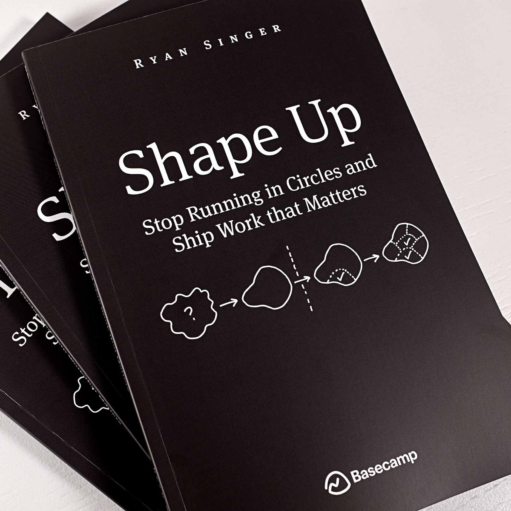
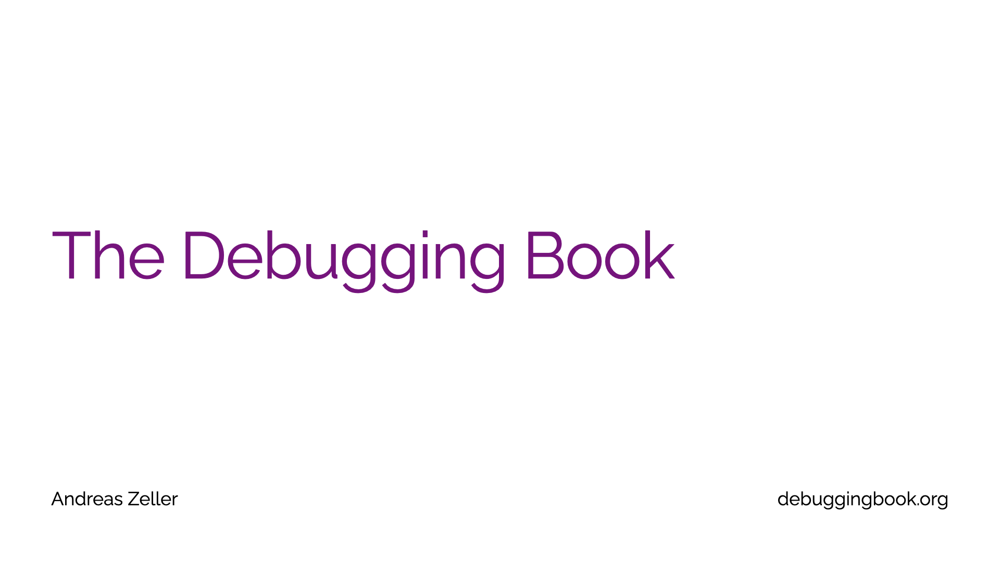
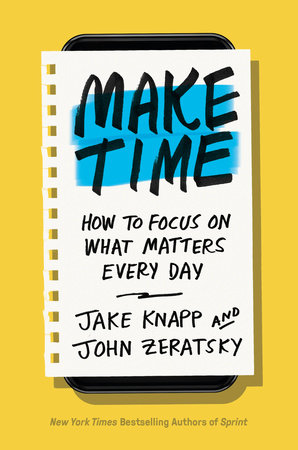
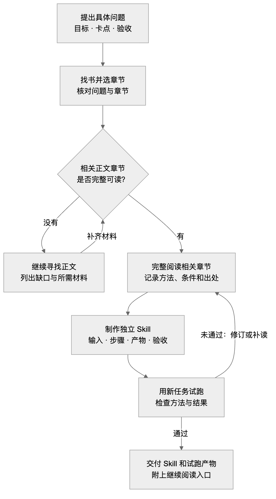

**简体中文** · [English](README.en.md) · [日本語](README.ja.md)

# QBS · 不熟悉一个领域，也能从问题开始做 Skill

> *「带着你的问题，让 AI 找书、读相关章节，把方法做成自己的 Skill。」*

[](skills/qbs/SKILL.md)
[](https://github.com/LearnPrompt/qbs/actions/workflows/check.yml)
[](LICENSE)

**QBS = Question → Book → Skill。** 你提供一个想解决的问题，QBS 驱动 AI 找到相关书籍、完整读相关正文章节、提炼方法，制作一个可独立调用的 Skill，再用实际任务检验。

[怎么做出 Skill](#workflow) · [安装 QBS](#install) · [第一次使用](#first-use) · [会拿到什么](#deliverables) · [制作案例与进展](#examples)

---

<a id="why-qbs"></a>

## 想做一个 Skill，却不知道该把什么经验写进去

每天都在用 Codex，遇到重复的问题，很自然就想把处理方法存成 Skill。可换到一个自己不熟悉的领域，问题就来了。没读过相关的书，也没积累多少经验，该写哪些步骤？AI 给的判断，自己又该怎么验？只把几轮聊天整理成文件，文件是有了，方法的依据还没着落。

所以我们做了 QBS。你先说清眼前的事，找书、取得正文、阅读和提炼交给 AI。围绕这一个问题读相关章节，把作者的方法、适用条件和例外，转成可以执行和检查的步骤。**从一个真实问题开始，做出有出处、能试用、可以继续修改的 Skill。你不必先系统学完这个领域。**

### 用这条路线做出来的 Skill

<table>
<tr>
<td align="center" width="33%"><a href="books/shape-up.md"></a><br><a href="books/shape-up.md"><strong>Shape Up</strong></a><br>控制小功能的范围</td>
<td align="center" width="33%"><a href="books/the-debugging-book.md"></a><br><a href="books/the-debugging-book.md"><strong>The Debugging Book</strong></a><br>让调试停止猜测</td>
<td align="center" width="33%"><a href="books/make-time.md"></a><br><a href="books/make-time.md"><strong>Make Time</strong></a><br>找回被打碎的一天<br><sub>draft</sub></td>
</tr>
</table>

| Skill | 解决什么问题 | 已读内容 |
|---|---|---|
| `shape-up` | AI 把小需求越做越大，不知道什么时候该停 | 完整读第 3、14 章；试跑 3 个场景 |
| `the-debugging-book` | AI 修 bug 反复猜，说不清排除了什么 | 完整读 Introduction to Debugging 含练习 |
| `make-time` | 一天被 AI 任务打成碎片，忙完什么都没做成 | 回读 Highlight 章 + Laser 章；draft |

<a id="workflow"></a>

## 从问题到自己的 Skill



[流程图源文件](assets/qbs-flow.zh-CN.mmd)

这条流程的完整说明在 [QBS Skill](skills/qbs/SKILL.md)。拿不到正文时会报告具体缺口；找到书名、读过序言都不能算完成了相关章节阅读。

### 能多快？

你可以直接从自己的问题开始，不用先自行选书、系统学完一个领域再动手。QBS 把找书、阅读、制作和试跑接成一条流程。实际耗时取决于正文能否取得、要读多少内容和试跑后需要改几轮；目前没有完整计时数据，暂不承诺“几分钟做完”。

<a id="install"></a>

## 一行安装 QBS

电脑上有 Node.js、npm（含 `npx`）和 Git 后，运行：

```bash
npx skills@latest add LearnPrompt/qbs --skill qbs
```

选择你使用的 Agent。默认装到当前项目；想在所有项目里使用，在命令末尾加 `-g`。安装后新开会话，就可以让 QBS 帮你做自己的 Skill。

<details>
<summary>指定 Agent</summary>

装到当前项目的 Codex 和 Claude Code：

```bash
npx skills@latest add LearnPrompt/qbs --skill qbs -a codex claude-code -y
```

</details>

[安装器与参数说明](https://github.com/vercel-labs/skills#install-a-skill) · [安装实测记录](docs/npx-install-check.md) · [手动安装](docs/manual-install.md)。已有同名 Skill 且改过内容时，先备份再更新。

<a id="first-use"></a>

## 装完，把你的问题交给 QBS

把下面的方括号换成自己的情况，直接发给 Agent：

```text
使用 $qbs。我不熟悉[领域]，现在想解决[具体问题]，希望最后得到[可检查的结果]。请主动找相关书籍，取得并完整阅读相关正文章节，把方法做成一个可独立调用的 Skill，再用一个新任务试跑。交付 Skill、试跑结果，以及实际读过的章节和方法出处。拿不到完整正文时，请说明具体缺口。
```

例如：“使用 $qbs。我在 Codex 里做小功能时，需求经常越聊越大。请找书并完整读相关章节，做一个帮我确定本轮范围的 Skill，再拿我这次的功能需求试跑。”

你不需要提前知道书名。已经选好书、拥有电子文件或章节材料，也可以一起提供。

<a id="deliverables"></a>

## 做完，你应该拿到什么

| 交付 | 你能检查什么 |
|---|---|
| 一个可独立调用的 Skill | 什么时候用、需要什么输入、按什么步骤做、交什么结果 |
| 来源与阅读记录 | 实际读了哪本书的哪些章节，哪些规则来自书里，哪些是场景补充 |
| 一次新任务的试跑产物 | 输入是什么，方法怎么用，哪些验收项通过或没通过 |
| 继续阅读的入口 | 这次用上的方法在书里哪里，自己想深入时从哪里开始 |

以后遇到同类问题，可以直接调用做好的 Skill；换一个新领域，再从 QBS 开始。只有书单或一个未经试跑的文件，流程还没完成。

---

<a id="examples"></a>
<a id="everyday-problems"></a>
<a id="reading-status"></a>

## 直接试用已经做好的 Skill

只需要其中一本时，保留对应名称即可。

```bash
npx skills@latest add LearnPrompt/qbs --skill shape-up the-debugging-book
```

```text
使用 $shape-up。我想给客户列表加一个”导出当前筛选结果”的功能，只愿投入两个半天。请确定本轮必要范围、暂缓项、未知条件和验收标准。

使用 $the-debugging-book。这段代码第一次分页正常，后面换页却重复旧结果。请复现、用实验区分原因，完成修复和回归，并告诉我关键判断来自书中哪里。
```

<details>
<summary>维护者验证命令</summary>

```bash
python3 scripts/validate.py
python3 -m unittest discover -s tests -v
```

检查技能包、引用、书籍索引、多语言文档链接，以及安装读回和失败处理。[GitHub Actions](https://github.com/LearnPrompt/qbs/actions/workflows/check.yml) 自动运行这些检查，顶部徽章显示真实状态。书籍方法的实际效果还要看对应任务的试跑记录。

</details>

<a id="next-book"></a>

## 用过一个方法，也许就想把书翻开了

我们很久没好好读书了。所以我还想给这条路线留一个小小的后续：Skill 每次交付时，告诉我刚才那个判断来自哪一章。

先让方法参与今天的工作。如果它帮上了忙，自然就会好奇，作者为什么这么想，还有哪些地方值得继续读。

**带着问题做出一个 Skill，再带着使用后的好奇回到书里。**

[子 Skill 制作合约](skills/qbs/references/child-contract.md) · [MIT](LICENSE)（适用于本项目原创代码与说明；书籍原文和封面版权归原权利人）
