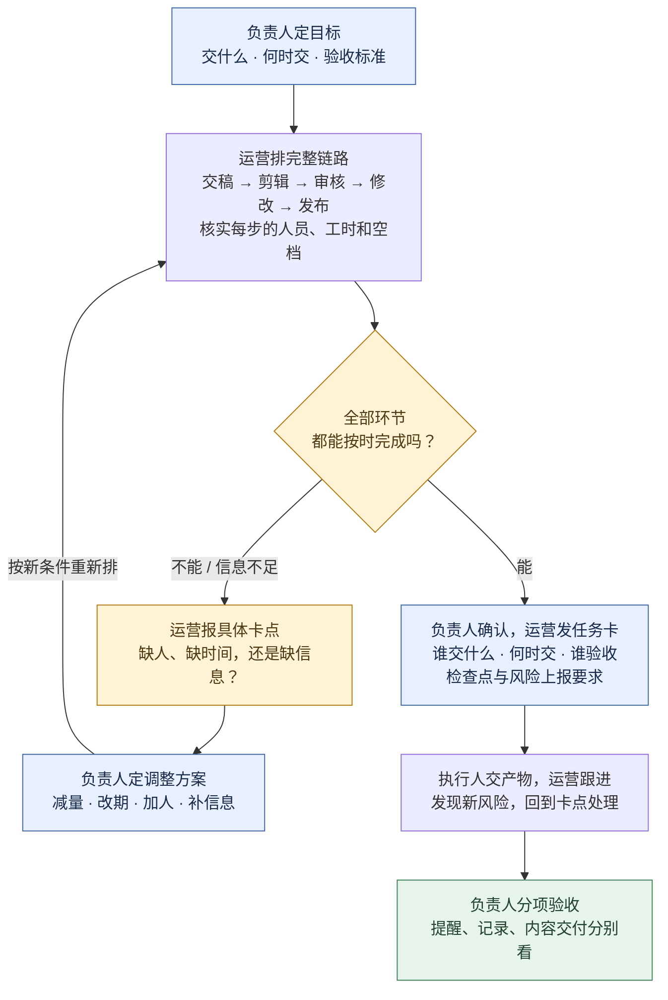
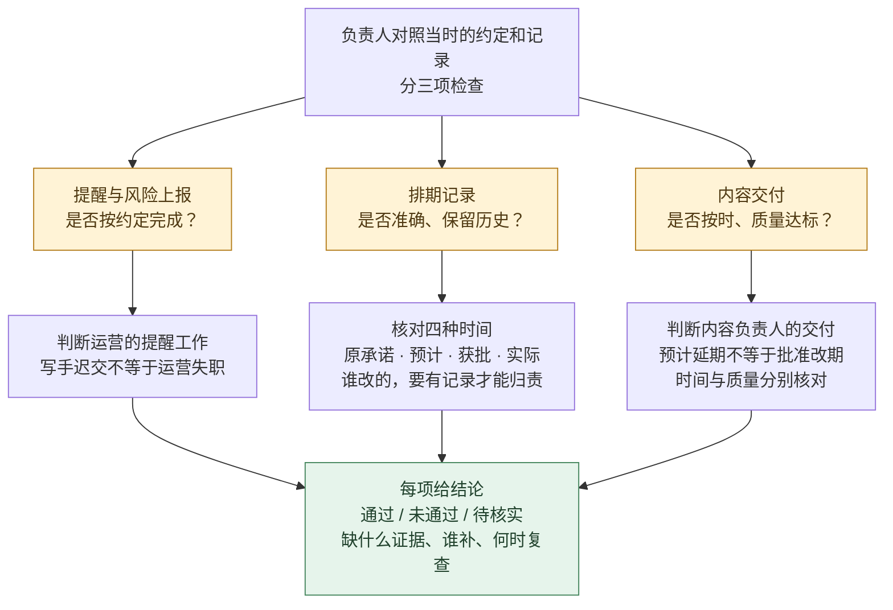

# QBS · 把书里的方法，变成能用的 Skill

> *「没读过这个领域的书，也能让 AI 先找书、读正文，再把方法做成 Skill。」*

[](skills/qbs/SKILL.md)
[](https://skills.sh/LearnPrompt/qbs)
[](LICENSE)

**从你遇到的问题出发，交付有出处的 Skill，以及能检查的任务结果。**

[看排活流程](#负责人照这张图排活) · [一行安装](#安装) · [怎么使用](#马上使用) · [书籍与技能](#书籍与技能) · [实际验证](#验证)

---

## 它解决什么问题

想把内容团队的排期交出去，却不知道该怎么交接、怎样验收？QBS 从这样的实际问题出发，让 AI 找书并读相关正文，再把方法变成能反复用的流程。

你还没系统读过这个领域的书，也可以从一个真实问题开始：找可靠资料，把方法写成可重复执行的步骤，再拿新问题检验。**QBS 不要求你先成为专家，但要求方法有来源、结论有边界、结果能检查。**

`实际问题 → AI主动找书 → 定位章节并取得正文 → 完整读相关章 → 提炼方法 → 生成 Skill → 用任务检验`

找书和读书由执行 QBS 的 AI 完成，不要求用户先熟悉领域。它会实际核对候选书、访问正文并留下阅读记录；选书推荐、找到文件和读完章节分别报告。[查看完整找书与阅读流程](skills/qbs/SKILL.md)。

## 马上使用

当前书籍子 Skill 尚缺完整正文章节，只适合作为场景草案演练：

> 使用 $high-output-management。我想把内容排期维护和交稿提醒交给运营。下面是团队分工、任务和现有约定，请给我一张能转发的任务卡与验收标准：……

想把另一本书的方法做成自己的 Skill，用父 Skill：

> 使用 $qbs。我没系统学过这个领域，眼前的问题是……请主动找一本合适的书，取得并完整阅读相关正文章节，记录哪些方法来自哪里，再做成 Skill，并拿一个任务试跑。拿不到完整正文时告诉我具体缺口。

仅有书名时先找材料；已有指定书时直接围绕该书。不会把推荐一本书等同于已经读过，也不把一次聊天中的猜测变成通用规则。

## 书籍与技能

[](books/high-output-management.md)

Andrew S. Grove 著 · [书籍说明与阅读范围](books/high-output-management.md) · 封面由 Penguin Random House 提供，版权归原权利人。

| 入口 | 负责什么 | 当前证据 |
|---|---|---|
| [`qbs`](skills/qbs/SKILL.md) · 父 Skill | 选资料、核对阅读范围、提取方法、创建和验证子 Skill | 见[行为试跑](evals/RESULTS.md) |
| [`high-output-management`](skills/high-output-management/SKILL.md) · 书籍子 Skill 草案 | 内容团队的委派、共享资源排期、提醒草稿和证据验收 | draft；待补完整相关正文，旧模拟不替代来源验证 |

**第一本书只读了出版社公开的 Ben Horowitz 2015 新版序言，未阅读全文。** 团队产出、提前规划、按任务经验安排指导是来源启发；具体时间字段、冲突检查和验收流程是本项目的场景设计。[查看来源映射](skills/high-output-management/references/source-notes.md)。

本项目现要求书籍方法 Skill 至少完整读一个相关正文章节，并按实际涉及的方法继续补读。序言不能代替正文；当前例子因此退回 draft，待补阅读后重做来源映射及测试。此前三组对照只评价序言启发的旧版，不代表已经测试了充分阅读正文后的 QBS。[查看正文补查记录](docs/chapter-source-gap.md)。

父子表示职责与索引关系：两个 Skill 各自有入口，分别安装。日常处理排期时直接调用子 Skill，不需要每次重新找书。书籍文件放在各自包里，离开本仓库仍能使用；未安装的子 Skill 不会因为索引里列出来就自动可用。

## 负责人照这张图排活

**负责人定交付、拍板变更；运营排节点、报冲突；执行人交产物。**

### 先排活：排不下，就带着选项找负责人



例如：两条视频都在 13:00 交稿，各需剪辑 3 小时，希望 18:00 发布；唯一剪辑员只在 13:00–18:00 可用。**6 小时的活，只有 5 小时可做**，在剪辑环节就排不下。**不能把下班后的 19:00 当成可用时间；即使加了剪辑，也要重新检查审核、修改和发布是否接得上。**

### 再验收：催过稿，不等于整件事都合格



例如：运营按约定提醒、也报告了风险，但写手仍迟交——提醒工作可以通过，内容按时交付仍不通过；若表格丢了原截止时间，记录维护还要单独检查。**不能改掉截止时间来消除延期，也不能事后追加标准处罚过去的行为。**

以上是场景设计与模拟结果，尚未补齐书籍正文依据，也不是线上团队业绩。[查看模拟输入、实际输出与证据边界](evals/RESULTS.md)。

## 安装

已安装 Node.js、npm（含 `npx`）和 Git 的电脑，直接运行：

```bash
npx skills@latest add LearnPrompt/qbs
```

交互安装时，选择 `qbs`、`high-output-management` 和你使用的 Agent；在 Agent 内执行时，安装器可能自动选择当前 Agent。默认装到当前项目；想在所有项目里使用，在命令末尾加 `-g`。不需要手动克隆仓库，也不需要 Python。[安装器与参数说明](https://github.com/vercel-labs/skills#install-a-skill)。

**装完第一句话，复制给 Agent：**

```text
使用 $qbs。我想把内容团队的排期交给运营，但不知道该怎样交接和验收。请找一本相关的书，取得并完整阅读相关正文章节，把有出处的方法做成 Skill，再给我一份实际的任务卡、排期与验收结果。拿不到正文就说明缺哪几章，不要只凭序言生成。
```

只想试用现有排期草案，可以说：

```text
使用 $high-output-management。两条视频都在 13:00 交稿，各需剪辑 3 小时；唯一剪辑员 13:00–18:00 可用，两条都希望 18:00 发布。先判断排不排得下，再告诉我需要拍板什么，不要假设有人加班。
```

<details>
<summary>指定 Agent 或只安装一个 Skill</summary>

装到当前项目的 Codex 和 Claude Code，包含两个 Skill：

```bash
npx skills@latest add LearnPrompt/qbs --skill qbs high-output-management -a codex claude-code -y
```

只装找书、读书、制作技能的流程：

```bash
npx skills@latest add LearnPrompt/qbs --skill qbs
```

只装现有内容团队草案：

```bash
npx skills@latest add LearnPrompt/qbs --skill high-output-management
```

</details>

安装后新开会话，调用对应 Skill 即可。本次已实测从 GitHub 安装两个 Skill 及分别单装，并逐文件核对正文、模板和引用资料。[查看安装实测](docs/npx-install-check.md)。已有同名 Skill 且改过内容时，先备份再更新。

需要手动复制或维护仓库，见[手动安装](docs/manual-install.md)。

## 验证

维护者检出仓库后运行：

```bash
python3 scripts/validate.py
python3 -m unittest discover -s tests -v
```

第一条检查技能包、独立引用、书籍索引和封面链接；第二条验证安装读回、单独安装、拒绝覆盖、异常时保留用户文件以及包校验的失败路径。这些都是静态或文件操作检查。

决策行为另由独立子代理处理未见过的模拟输入，再逐项核对结果。完整记录、局限和状态见 [验证记录](evals/RESULTS.md)。随后进行了[直接对话／附序言／使用 Skill 的小型对照](evals/comparison-2026-09-18/REPORT.md)：三组均给出正确的核心排期与验收判断，**本例未证明 Skill 优于直接对话**。真实团队效果仍需要使用记录。

## 添加一本书

让 QBS 按 [子 Skill 合约](skills/qbs/references/child-contract.md) 制作即可。一个子 Skill 应包含：

- 能解决的具体问题与可观察交付。
- 实际读过的来源、范围与方法边界。
- 自身目录内的必要引用和模板。
- 带出版社封面及归属说明的书籍页。
- 新案例的输入、实际输出和判定。

在 `skills/qbs/references/library.json` 登记。只有目录、二手摘要或模型记忆时，不应发布「全书专家」；暂缺封面时可以继续做方法试验，书籍卡保持待补状态。

公开部分不要包含原书正文、私人团队资料或账户信息。MIT 许可只覆盖本项目原创代码、指令和说明，原书与封面不因此变成开源素材。

## 设计取舍

QBS 是本项目对「问题 → 书 → Skill」的工作流命名，不宣称行业标准或保证解决所有问题。书龄不是质量门槛，生成文件也不等于拥有专业能力。

本次用 [laoyeye](https://github.com/LearnPrompt/laoyeye) 的点子王路径审视父子结构，保留了来源范围、独立安装和反例验证，删掉了不必要的平台与批量抓书设想。[阅读审视记录](docs/laoyeye-review.md)。

本项目不自带任务系统连接器或常驻提醒。起草任务卡不等于授权修改外部系统或给同事发送消息。
