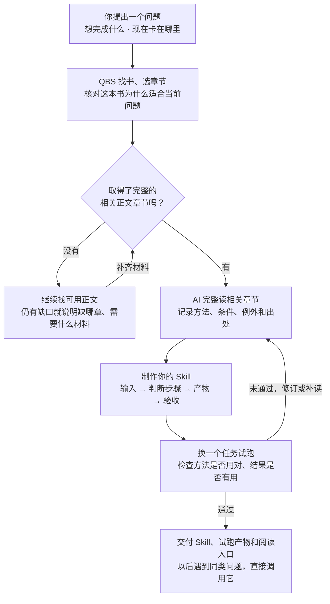

**简体中文** · [English](README.en.md) · [日本語](README.ja.md)

# QBS · 不熟悉一个领域，也能从问题开始做 Skill

> *「带着你的问题，让 AI 找书、读相关章节，把方法做成自己的 Skill。」*

[](skills/qbs/SKILL.md)
[](https://github.com/LearnPrompt/qbs/actions/workflows/check.yml)
[](LICENSE)

**QBS = Question → Book → Skill。** 你提供一个想解决的问题，QBS 驱动 AI 找到相关书籍、完整读相关正文章节、提炼方法，制作一个可独立调用的 Skill，再用实际任务检验。

[怎么做出 Skill](#workflow) · [安装 QBS](#install) · [第一次使用](#first-use) · [会拿到什么](#deliverables) · [制作案例与进展](#examples)

---

<a id="why-qbs"></a>

## 想做一个 Skill，却不知道该把什么经验写进去

每天都在用 Codex，遇到重复的问题，很自然就想把处理方法存成 Skill。

可换到一个自己不熟悉的领域，问题就来了。没读过相关的书，也没积累多少经验，该写哪些步骤？AI 给的判断，自己又该怎么验？

只把几轮聊天整理成文件，文件是有了，方法的依据还没着落。

所以我们做了 QBS。你先说清眼前的事，找书、取得正文、阅读和提炼交给 AI。围绕这一个问题读相关章节，把作者的方法、适用条件和例外，转成可以执行和检查的步骤。

**从一个真实问题开始，做出有出处、能试用、可以继续修改的 Skill。你不必先系统学完这个领域。**

<a id="workflow"></a>

## 从问题到自己的 Skill



这条流程的完整说明在 [QBS Skill](skills/qbs/SKILL.md)。拿不到正文时会报告具体缺口；找到书名、读过序言都不能算完成了相关章节阅读。

### 能多快？

你可以直接从自己的问题开始，不用先自行选书、系统学完一个领域再动手。QBS 把找书、阅读、制作和试跑接成一条流程。实际耗时取决于正文能否取得、要读多少内容和试跑后需要改几轮；目前没有完整计时数据，暂不承诺“几分钟做完”。

<a id="install"></a>

## 一行安装 QBS

电脑上有 Node.js、npm（含 `npx`）和 Git 后，运行：

```bash
npx skills@latest add LearnPrompt/qbs --skill qbs
```

选择你使用的 Agent。默认装到当前项目；想在所有项目里使用，在命令末尾加 `-g`。安装后新开会话，就可以让 QBS 帮你做自己的 Skill。

<details>
<summary>指定 Agent</summary>

装到当前项目的 Codex 和 Claude Code：

```bash
npx skills@latest add LearnPrompt/qbs --skill qbs -a codex claude-code -y
```

</details>

[安装器与参数说明](https://github.com/vercel-labs/skills#install-a-skill) · [安装实测记录](docs/npx-install-check.md) · [手动安装](docs/manual-install.md)。已有同名 Skill 且改过内容时，先备份再更新。

<a id="first-use"></a>

## 装完，把你的问题交给 QBS

把下面的方括号换成自己的情况，直接发给 Agent：

```text
使用 $qbs。我不熟悉[领域]，现在想解决[具体问题]，希望最后得到[可检查的结果]。请主动找相关书籍，取得并完整阅读相关正文章节，把方法做成一个可独立调用的 Skill，再用一个新任务试跑。交付 Skill、试跑结果，以及实际读过的章节和方法出处。拿不到完整正文时，请说明具体缺口。
```

例如：“使用 $qbs。我在 Codex 里做小功能时，需求经常越聊越大。请找书并完整读相关章节，做一个帮我确定本轮范围的 Skill，再拿我这次的功能需求试跑。”

你不需要提前知道书名。已经选好书、拥有电子文件或章节材料，也可以一起提供。

<a id="deliverables"></a>

## 做完，你应该拿到什么

| 交付 | 你能检查什么 |
|---|---|
| 一个可独立调用的 Skill | 什么时候用、需要什么输入、按什么步骤做、交什么结果 |
| 来源与阅读记录 | 实际读了哪本书的哪些章节，哪些规则来自书里，哪些是场景补充 |
| 一次新任务的试跑产物 | 输入是什么，方法怎么用，哪些验收项通过或没通过 |
| 继续阅读的入口 | 这次用上的方法在书里哪里，自己想深入时从哪里开始 |

以后遇到同类问题，可以直接调用做好的 Skill；换一个新领域，再从 QBS 开始。只有书单或一个未经试跑的文件，流程还没完成。

---

<a id="examples"></a>
<a id="everyday-problems"></a>
<a id="reading-status"></a>

## 我们用这条路线在做什么

排期是探索 QBS 时做的第一个案例。后面又从 Codex 里常见的两个问题出发选了书。它们展示不同阶段的产物，也暴露了流程还需要补齐的地方。

| 问题 | 选书 | 当前进展 |
|---|---|---|
| 活交给同事，怎样分工、排期和验收？ | [High Output Management](books/high-output-management.md) | 已有可安装草案；只完整读了公开新版序言，相关正文待补，尚未满足现行 QBS 的章节要求 |
| 一个小功能，怎样避免越做越大？ | [Shape Up](books/shape-up.md) | 完整读第 3、14 章；尚未打包成子 Skill |
| bug 改了几轮，怎样停止猜测？ | [The Debugging Book](books/the-debugging-book.md) | 完整读 Introduction to Debugging，含练习答案；尚未打包成子 Skill |

<a id="scheduling-flow"></a>

<details>
<summary>展开第一个产物示例：排期 Skill 草案</summary>

两条视频各需剪辑 3 小时，唯一剪辑员只有 5 小时可用。这个草案的模拟产物识别出排不下，并要求重新核对审核、返工和发布的时间。排期和验收的两张流程图放在[案例详情](docs/scheduling-example.md)，它们是这个子 Skill 的业务流程。

[模拟输入与实际输出](evals/RESULTS.md) · [草案入口](skills/high-output-management/SKILL.md)

如果你恰好要试这个草案，可以另行安装：

```bash
npx skills@latest add LearnPrompt/qbs --skill high-output-management
```

```text
使用 $high-output-management。两条视频都在 13:00 交稿，各需剪辑 3 小时；唯一剪辑员 13:00–18:00 可用，两条都希望 18:00 发布。先判断排不排得下，再告诉我需要拍板什么，不要假设有人加班。
```

这些是场景设计与模拟。此前的[三组对照](evals/comparison-2026-09-18/REPORT.md)中，普通对话也给出了正确的核心判断，没有证明这个草案优于直接对话。

</details>

<details>
<summary>维护者验证命令</summary>

```bash
python3 scripts/validate.py
python3 -m unittest discover -s tests -v
```

检查技能包、引用、书籍索引、多语言文档链接，以及安装读回和失败处理。[GitHub Actions](https://github.com/LearnPrompt/qbs/actions/workflows/check.yml) 自动运行这些检查，顶部徽章显示真实状态。书籍方法的实际效果还要看对应任务的试跑记录。

</details>

<a id="next-book"></a>

## 用过一个方法，也许就想把书翻开了

我们很久没好好读书了。所以我还想给这条路线留一个小小的后续：Skill 每次交付时，告诉我刚才那个判断来自哪一章。

先让方法参与今天的工作。如果它帮上了忙，自然就会好奇，作者为什么这么想，还有哪些地方值得继续读。

**带着问题做出一个 Skill，再带着使用后的好奇回到书里。**

[子 Skill 制作合约](skills/qbs/references/child-contract.md) · [MIT](LICENSE)（适用于本项目原创代码与说明；书籍原文和封面版权归原权利人）
