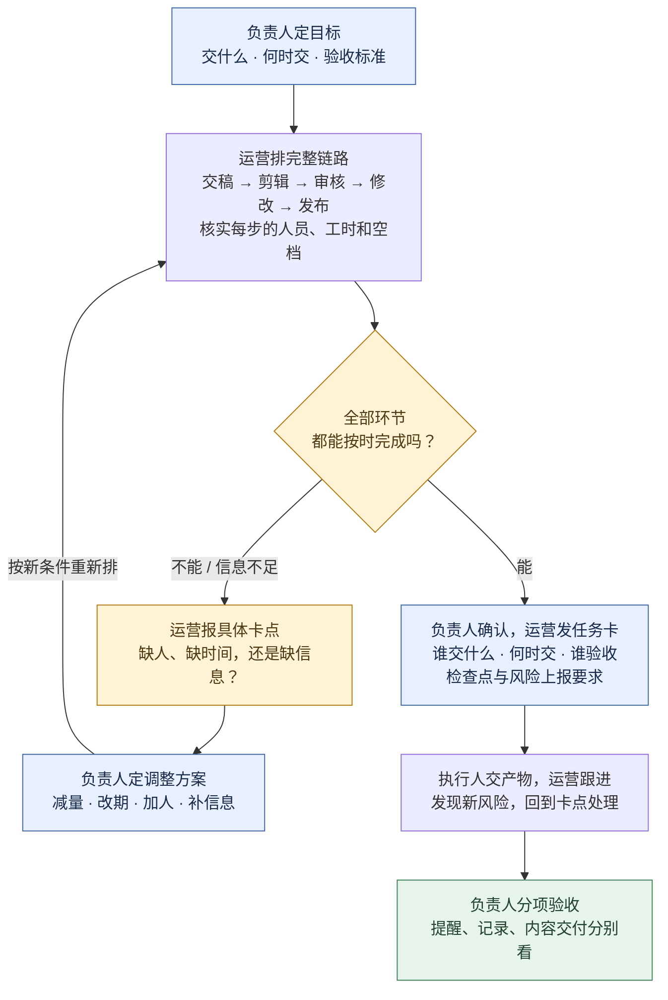
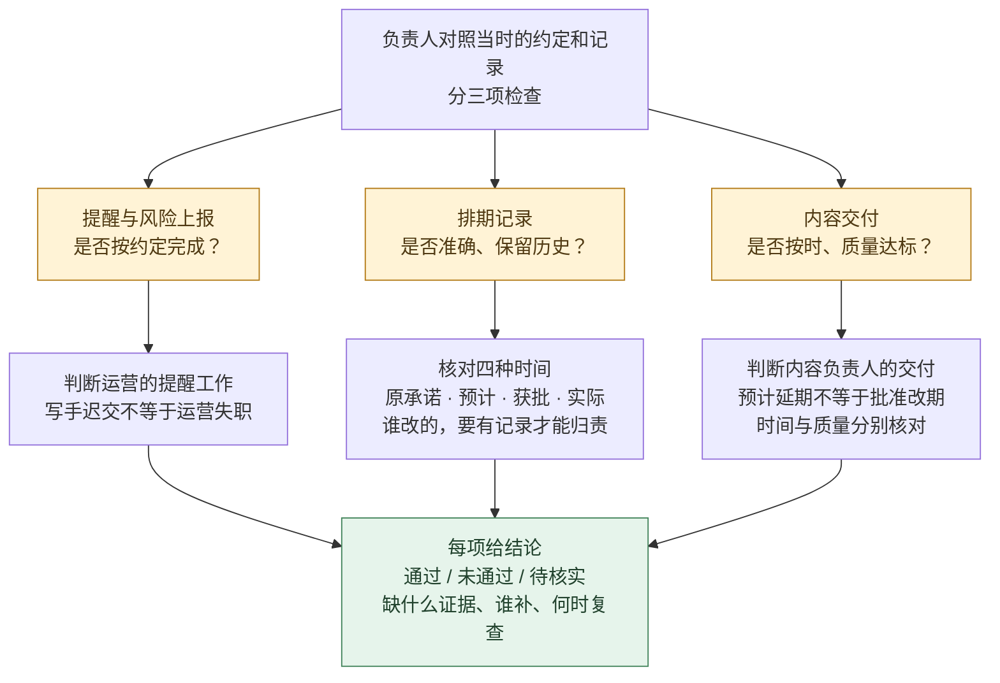

**简体中文** · [English](README.en.md) · [日本語](README.ja.md)

# QBS · 从每天用的 Skill，重新想读一本书

> *「先让一本书帮上今天的忙，再想回去读它。」*

[](skills/qbs/SKILL.md)
[](https://github.com/LearnPrompt/qbs/actions/workflows/check.yml)
[](LICENSE)

[为什么做](#why-qbs) · [从三个麻烦开始](#everyday-problems) · [一行安装](#install) · [读到哪了](#reading-status)

---

<a id="why-qbs"></a>

## 我们已经很久没好好读书了

每天都在打开 Codex，让它写东西、改代码、做项目。Skill 装了不少，遇到问题也很自然地先去找一个能帮忙的。

书倒是很久没好好读了。

所以我想试试，把重新开始读书的入口，放到每天都在做的事情里。

比如想把排期交给同事，却不知道怎样算交接清楚。比如只想改一个小功能，聊着聊着，待办越来越长。再比如一个 bug，改过几轮之后，还是说不清为什么出错。

先拿其中一件事，让 AI 去找一本相关的书，读完对应章节，把能用的方法做成 Skill，再放回我们的工作里试。

如果它真的帮上忙了，好奇心可能就会回来。

刚才为什么要先问这一句？为什么少做几个功能，反而更接近我要的结果？这个方法还有什么我没用到的地方？

到这一步，再去读作者写的那一章，就有了自己的问题。

**我想做的 QBS，就是让一本书先和我们的生活发生一点关系。用过其中一个方法，再愿意多读一点。**

`今天的问题 → 找一本书 → AI 完整读相关章节 → 做成 Skill → 用在今天的事上 → 带着好奇回到原书`

每次用到书里的方法，交付旁边都留一个具体的阅读入口。点进去能找到刚才那个判断的来处，也能看到作者为什么这样想。

---

<a id="everyday-problems"></a>

## 从三个每天会碰到的麻烦开始

### 活分出去了，怎么还是得自己盯？

第一本从 Andrew S. Grove 的《High Output Management》开始。问题很具体，想把内容团队的排期交给运营，交什么、遇到冲突谁拍板、做完怎么验收，都得说清楚。

第一版只读了公开序言，规则主要来自场景设计，暂时保留为草案。

这份草案做过一次排期演练。两条视频各要剪 3 小时，唯一剪辑员当天只剩 5 小时。排期表写得再整齐，这一天也装不下 6 小时的活。需要有人决定减量、改期或加人，再把审核和修改接上。

顺着这个例子，还可以继续追问，团队的产出到底卡在哪里？负责人做什么，才能让大家少绕一点路？

[看排活流程](#scheduling-flow) · [这本书与现有草案](books/high-output-management.md)

### 只想改个小功能，怎么越聊越大？

在 Codex 里做项目，很容易从一个具体需求，聊出一整套系统。功能越列越多，这一轮究竟交什么，反而越来越模糊。

第二本选 Ryan Singer 的《Shape Up》。第 3 章先问，这个问题值得投入多少时间？再根据这个边界，决定方案做多大。书里有个很具体的例子，用户想要复杂的权限控制，追问出真正的困扰后，一个归档前的提醒就可能解决问题。

拿到我们的工作里，可以先把「优化一下安装体验」收窄成「让第一次看到的人，用一条命令装好，并知道下一句话怎么说」。完成这件事，就有一个能用的结果。

我想继续读下去的问题是，怎样删掉一些工作，又把真正有用的部分留下？

[读第 3 章 Set Boundaries](https://basecamp.com/shapeup/1.2-chapter-03) · [选书与阅读记录](books/shape-up.md)

### bug 改了几轮，怎么还在猜？

另一个熟悉的场景，报错出现了，先改个参数试试，再换种写法试试。偶尔好了，却说不清是哪一步起了作用，下次再出现还得重来。

第三本选 Andreas Zeller 的《The Debugging Book》。它提供可以直接阅读和运行的在线章节，适合把排错过程拆开看。

我们准备从「先复现，再提出一个可以被推翻的猜测」开始。让 Codex 在改代码之前说清楚，这次检查要验证什么；结果出来以后，哪些猜测还能成立。最后再用原来的失败案例检查修复。

这会把下一次阅读变成一个具体问题，怎样的证据，才足以让我相信自己找到了原因？

[读 Introduction to Debugging](https://www.debuggingbook.org/html/Intro_Debugging.html) · [选书与阅读记录](books/the-debugging-book.md)

---

<a id="scheduling-flow"></a>

## 负责人照这张图排活

**负责人定交付、拍板变更；运营排节点、报冲突；执行人交产物。**

### 先排活：排不下，就带着选项找负责人



例如：两条视频都在 13:00 交稿，各需剪辑 3 小时，希望 18:00 发布；唯一剪辑员只在 13:00–18:00 可用。**6 小时的活，只有 5 小时可做**，在剪辑环节就排不下。**不能把下班后的 19:00 当成可用时间；即使加了剪辑，也要重新检查审核、修改和发布是否接得上。**

### 再验收：催过稿，不等于整件事都合格



例如：运营按约定提醒、也报告了风险，但写手仍迟交——提醒工作可以通过，内容按时交付仍不通过；若表格丢了原截止时间，记录维护还要单独检查。**不能改掉截止时间来消除延期，也不能事后追加标准处罚过去的行为。**

[查看这次模拟的输入与实际输出](evals/RESULTS.md)。

---

<a id="install"></a>

## 安装

已安装 Node.js、npm（含 `npx`）和 Git 的电脑，直接运行：

```bash
npx skills@latest add LearnPrompt/qbs
```

交互安装时，选择 `qbs`、`high-output-management` 和你使用的 Agent；在 Agent 内执行时，安装器可能自动选择当前 Agent。默认装到当前项目；想在所有项目里使用，在命令末尾加 `-g`。不需要手动克隆仓库，也不需要 Python。[安装器与参数说明](https://github.com/vercel-labs/skills#install-a-skill)。

**装完第一句话，复制给 Agent：**

```text
使用 $qbs。我想把内容团队的排期交给运营，但不知道该怎样交接和验收。请找一本相关的书，取得并完整阅读相关正文章节，把有出处的方法做成 Skill，再给我一份实际的任务卡、排期与验收结果。拿不到正文就说明缺哪几章，不要只凭序言生成。
```

只想试用现有排期草案，可以说：

```text
使用 $high-output-management。两条视频都在 13:00 交稿，各需剪辑 3 小时；唯一剪辑员 13:00–18:00 可用，两条都希望 18:00 发布。先判断排不排得下，再告诉我需要拍板什么，不要假设有人加班。
```

<details>
<summary>指定 Agent 或只安装一个 Skill</summary>

装到当前项目的 Codex 和 Claude Code，包含两个 Skill：

```bash
npx skills@latest add LearnPrompt/qbs --skill qbs high-output-management -a codex claude-code -y
```

只装找书、读书、制作技能的流程：

```bash
npx skills@latest add LearnPrompt/qbs --skill qbs
```

只装现有内容团队草案：

```bash
npx skills@latest add LearnPrompt/qbs --skill high-output-management
```

</details>

安装后新开会话，调用对应 Skill 即可。本次已实测从 GitHub 安装两个 Skill 及分别单装，并逐文件核对正文、模板和引用资料。[查看安装实测](docs/npx-install-check.md)。已有同名 Skill 且改过内容时，先备份再更新。

需要手动复制或维护仓库，见[手动安装](docs/manual-install.md)。

---

<a id="reading-status"></a>

## 这些书现在读到哪了

| 书 | 本次对应的问题 | 进展 |
|---|---|---|
| [High Output Management](books/high-output-management.md) | 委派、排期与验收 | 已有可安装草案；目前只完整读了公开新版序言，相关正文待补 |
| [Shape Up](books/shape-up.md) | 需求越做越大，如何确定这轮范围 | 完整读第 3、14 章；尚未打包成子 Skill |
| [The Debugging Book](books/the-debugging-book.md) | 反复试改，如何用证据排错 | 完整读 Introduction to Debugging，含练习答案；尚未打包成子 Skill |

现在安装包里有 `qbs` 和 `high-output-management` 两个入口。新增两本书先把章节读扎实，再从实际任务里提炼和试用。书籍页保留了方法出处和下一步阅读入口。

排期案例是模拟，不是团队业绩。此前的[三组对照](evals/comparison-2026-09-18/REPORT.md)里，普通对话也给出了正确的核心判断。我们会继续记录 Skill 在日常任务里到底帮上了什么，也看看它有没有让人愿意回去读书。

<details>
<summary>维护者验证命令</summary>

维护者修改或发布仓库时运行，普通用户安装时不必执行：

```bash
python3 scripts/validate.py
python3 -m unittest discover -s tests -v
```

第一条检查技能包、引用、书籍索引、封面和多语言文档链接；第二条验证安装读回、单独安装、拒绝覆盖与失败处理。每次提交和 PR 都由 [GitHub Actions](https://github.com/LearnPrompt/qbs/actions/workflows/check.yml) 自动运行，顶部徽章显示真实状态。检查通过表示这些项目通过，不代表已经验证书籍方法的实际效果。

</details>

<a id="next-book"></a>

## 从你自己的问题，再找下一本

装好后，把今天卡住的一件事交给 QBS。它会找书、核对正文、阅读相关章节，再把方法变成能使用的步骤。你可以从下面这句话开始。

```text
使用 $qbs。我最近反复遇到的问题是……请找一本能帮助我理解这个问题的书，完整读相关章节，把方法做成 Skill，再用我今天的任务试一次。交付后告诉我，这次用到的方法在书里哪里，我想自己接着读。
```

已经有书或电子文件，也可以直接提供。新增方法的来源记录与试跑要求见[子 Skill 合约](skills/qbs/references/child-contract.md)。

**先解决一件小事。然后，也许我们就想把那本书翻开了。**

[MIT](LICENSE) 适用于本项目原创代码与说明；书籍原文和封面版权归原权利人。
