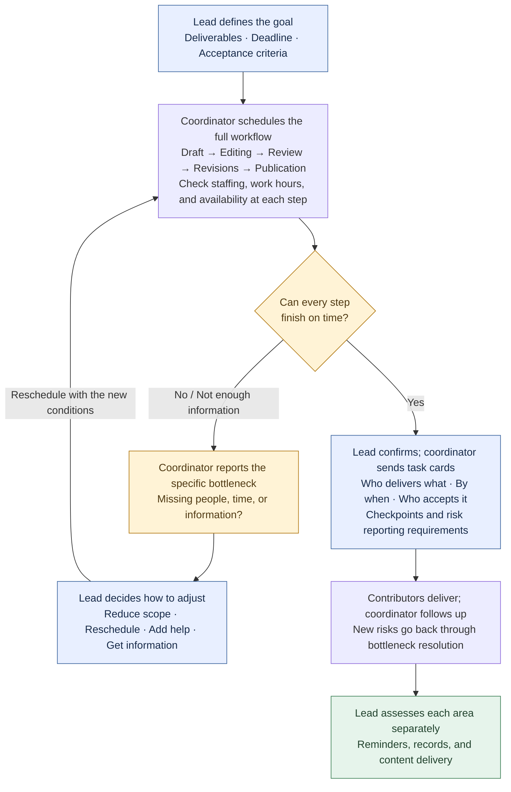
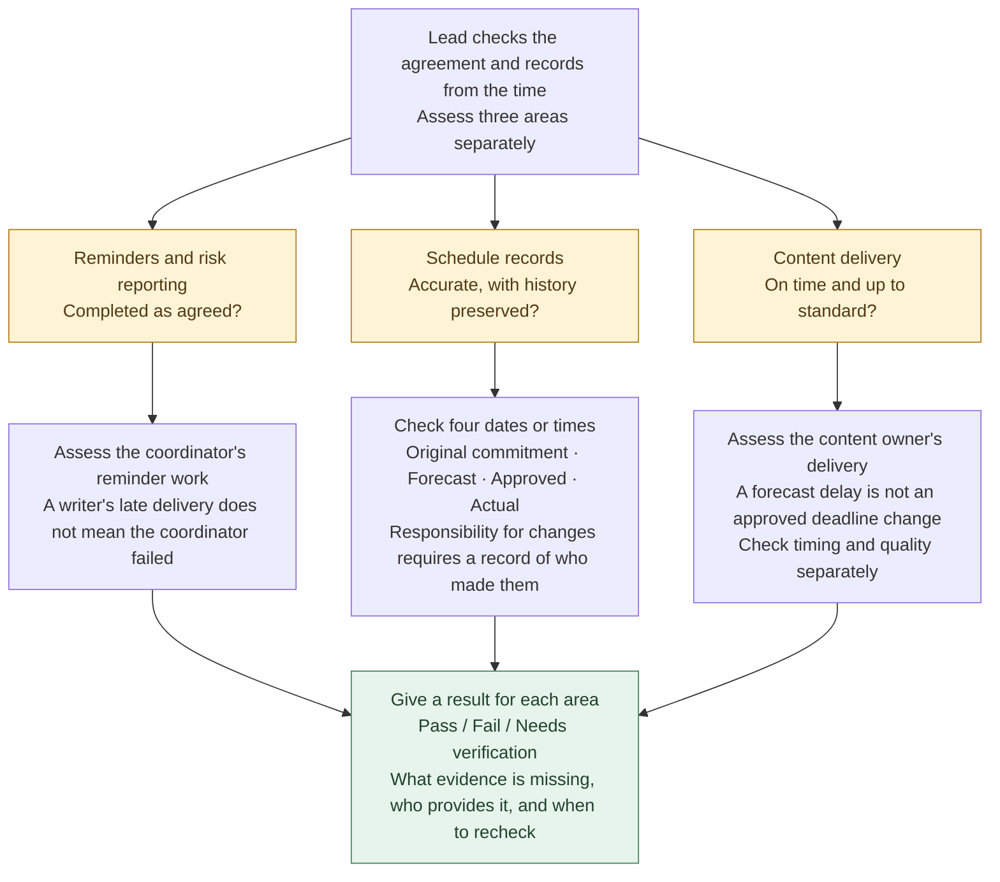

# Scheduling Skill draft: workflow example

This is the business workflow of the `high-output-management` draft, not the full QBS process for creating a Skill. Only the publicly available foreword has been read in full; the relevant main-text chapters are still missing. The draft does not yet meet the current QBS chapter-reading requirement.

[Back to QBS examples](../README.en.md#examples)

**The lead defines deliverables and approves changes; the coordinator schedules milestones and reports conflicts; contributors deliver the work.**

### First, schedule the work: if it won't fit, bring options to the lead

For example: both video drafts arrive at 13:00, each needs 3 hours of editing, and both are intended for publication at 18:00. The only editor is available from 13:00 to 18:00. **There are 6 hours of work and only 5 hours available**, so the editing stage already makes the schedule impossible. **19:00 is outside the editor's working hours and cannot be treated as available time. Even with another editor, review, revisions, and publication must all be checked again.**

### Then, assess the work: sending reminders doesn't mean everything passed

For example: the coordinator sent reminders and reported risks as agreed, but the writer still delivered late. The reminder work can pass while on-time content delivery still fails. If the spreadsheet lost the original deadline, record keeping needs a separate check. **Do not erase a delay by changing the deadline, or introduce new criteria after the fact to penalize past actions.**

[See the inputs and actual outputs from this simulation](../evals/RESULTS.md).

