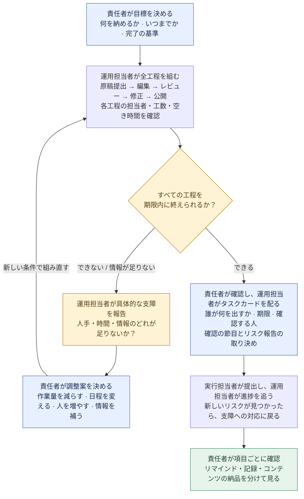
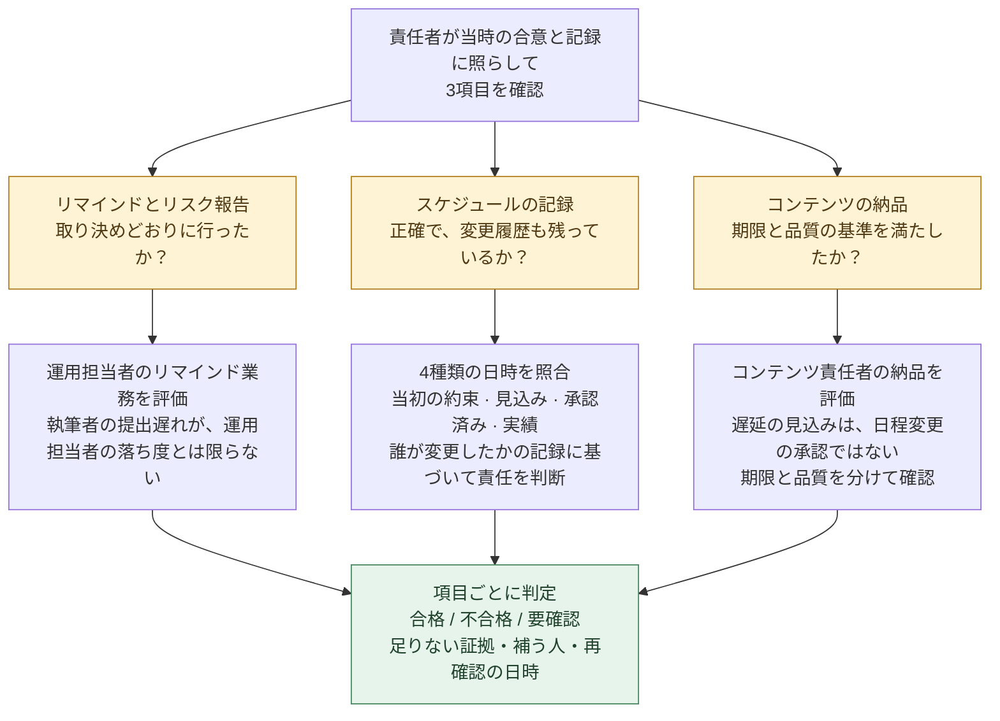

# スケジュール管理 Skill の草案：出力例

[QBS の制作事例に戻る](../README.ja.md#examples)

これは `high-output-management` という子 Skill の業務フローとシミュレーション例です。QBS 自体の制作フロー全体を示すものではありません。この草案で最後まで読んだのは、公開されている新版の序文だけです。関連する本文の章は未読で、現行 QBS の読書要件をまだ満たしていません。

## 責任者は、この流れで仕事を割り振る

**責任者は成果物と変更を決める。運用担当者は工程を組み、支障を報告する。実行担当者は成果物を提出する。**

### まず予定を組む：収まらなければ、選択肢を添えて責任者に相談する

たとえば、動画2本とも原稿提出が 13:00、編集は各3時間、公開希望は 18:00。編集担当者は1人だけで、作業できるのは 13:00–18:00 です。**6時間分の作業に対し、使えるのは5時間だけ**なので、編集の段階で予定が成立しません。**勤務時間外の 19:00 を、空き時間として扱ってはいけません。編集担当者を増やしても、レビュー・修正・公開までつなげられるか、改めて確認する必要があります。**

### 次に完了を確認する：催促したからといって、すべてが合格とは限らない

たとえば、運用担当者は取り決めどおりにリマインドし、リスクも報告したのに、執筆者の提出が遅れたとします。リマインド業務は合格でも、コンテンツの期限内納品は不合格です。表から元の締め切りが消えていたら、記録の管理も別に確認します。**締め切りを書き換えて遅延をなかったことにしたり、後から基準を追加して過去の行動に罰を与えたりしてはいけません。**

[今回のシミュレーションの入力と実際の出力を見る](../evals/RESULTS.md)。

以前の[3組の比較](../evals/comparison-2026-09-18/REPORT.md)では、通常の対話でも中心となる判断は正しくできていました。このシミュレーションは、草案が通常の対話より優れていることや、実際のチームで成果が改善したことを示す証拠ではありません。
