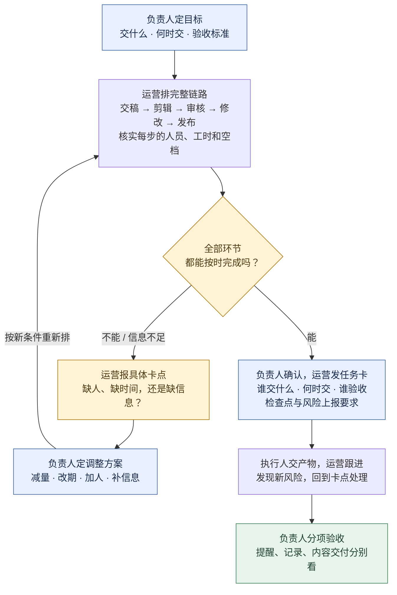
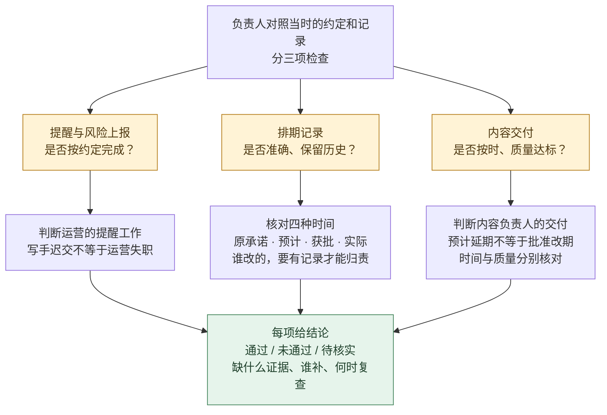

# QBS 产物示例：内容团队排期草案

[返回 QBS](../README.md#examples)

这是 QBS 的一个产物示例，目前只读了公开序言，相关正文章节待补。以下流程来自场景设计和模拟；它不代表 QBS 的完整制作流程。

## 负责人照这张图排活

**负责人定交付、拍板变更；运营排节点、报冲突；执行人交产物。**

### 先排活：排不下，就带着选项找负责人

例如：两条视频都在 13:00 交稿，各需剪辑 3 小时，希望 18:00 发布；唯一剪辑员只在 13:00–18:00 可用。**6 小时的活，只有 5 小时可做**，在剪辑环节就排不下。**不能把下班后的 19:00 当成可用时间；即使加了剪辑，也要重新检查审核、修改和发布是否接得上。**

### 再验收：催过稿，不等于整件事都合格

例如：运营按约定提醒、也报告了风险，但写手仍迟交——提醒工作可以通过，内容按时交付仍不通过；若表格丢了原截止时间，记录维护还要单独检查。**不能改掉截止时间来消除延期，也不能事后追加标准处罚过去的行为。**

[查看这次模拟的输入与实际输出](../evals/RESULTS.md)。

---

